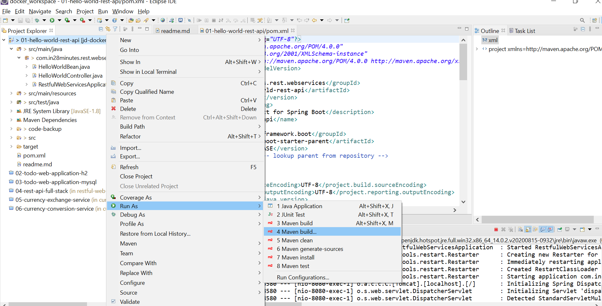
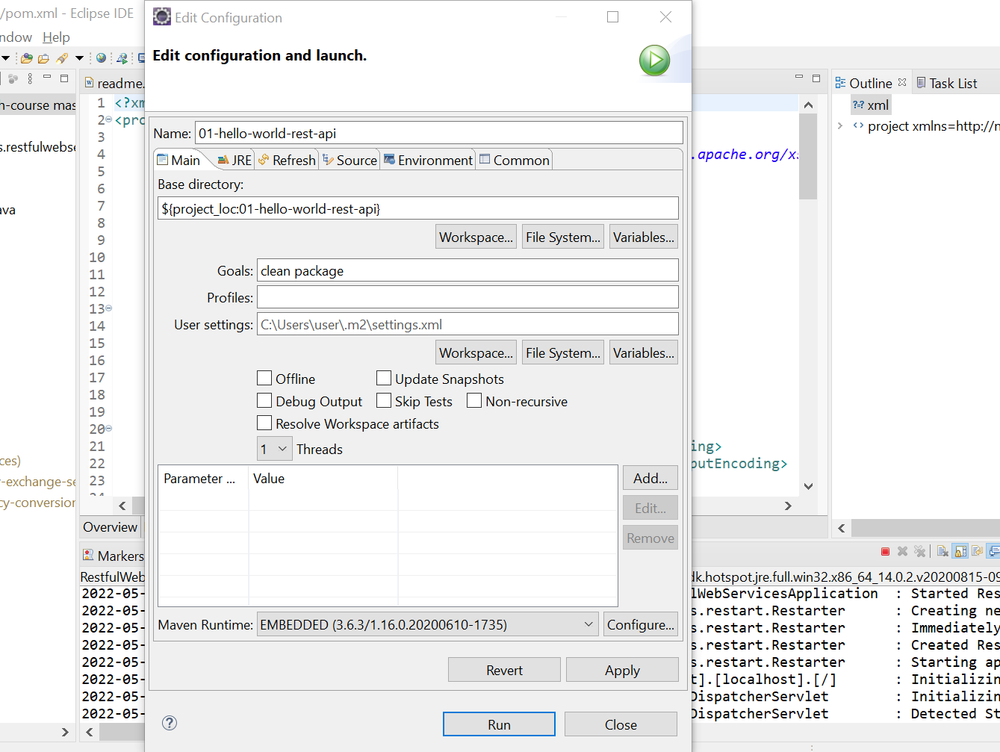
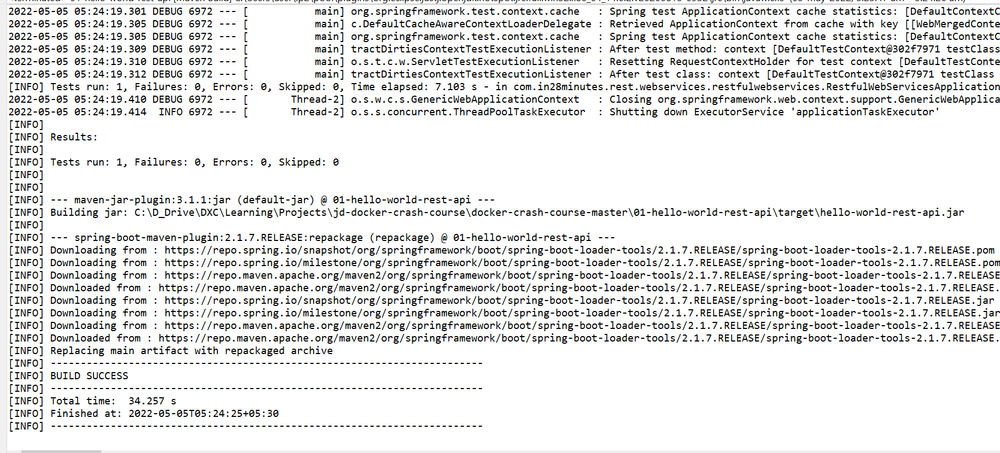
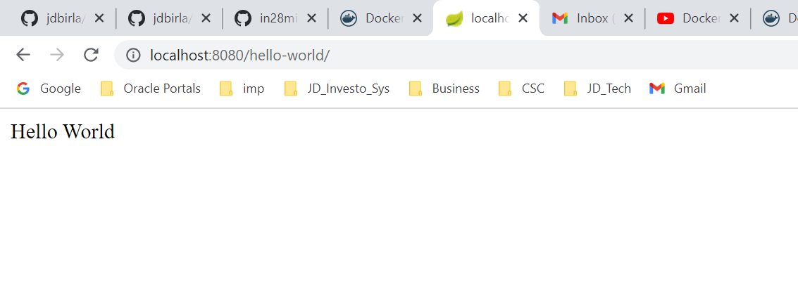

# JD Docker with Java Spring Boot Hello World

## What You Will Learn during this Step 01:
- Setting up 01 Spring Boot Hello World Rest API in Local 
---
## What You Will Learn during this Step 02:
- Build Docker Image Manually for 01 Hello World Rest API


### Docker Commands - Creating Image Manually

- docker run -dit openjdk:8-jdk-alpine
- docker container exec naughty_knuth ls /tmp
- docker container cp target/hello-world-rest-api.jar naughty_knuth:/tmp
- docker container exec naughty_knuth ls /tmp
- docker container commit naughty_knuth jitubirla/hello-world-rest-api:manual1
- docker run jitubirla/hello-world-rest-api:manual1
- docker container ls
- docker container commit --change='CMD ["java","-jar","/tmp/hello-world-rest-api.jar"]' naughty_knuth jitubirla/hello-world-rest-api:manual2
- docker run -p 8080:8080 jitubirla/hello-world-rest-api:manual2


### Building an Image

1. Build a Jar - /target/hello-world-rest-api.jar
2. Setup the Prerequisites for Running the JAR - openjdk:8-jdk-alpine
3. Copy the jar
4. Run the jar

1. Build a Jar - /target/hello-world-rest-api.jar
```
Building jar: C:\D_Drive\DXC\Learning\Projects\jd-docker-crash-course\docker-crash-course-master\01-hello-world-rest-api\target\hello-world-rest-api.jar
```






```
2. Setup the Prerequisites for Running the JAR - openjdk:8-jdk-alpine


C:\Users\user>cd C:\D_Drive\DXC\Learning\Projects\jd-docker-crash-course\docker-crash-course-master\01-hello-world-rest-api

C:\D_Drive\DXC\Learning\Projects\jd-docker-crash-course\docker-crash-course-master\01-hello-world-rest-api>docker run -dit openjdk:8-jdk-alpine
Unable to find image 'openjdk:8-jdk-alpine' locally
8-jdk-alpine: Pulling from library/openjdk
e7c96db7181b: Already exists
f910a506b6cb: Already exists
c2274a1a0e27: Already exists
Digest: sha256:94792824df2df33402f201713f932b58cb9de94a0cd524164a0f2283343547b3
Status: Downloaded newer image for openjdk:8-jdk-alpine
72ebb31f74858df58410702d654a63c8e08719e551b82154e7c60624b9380f2d


PS C:\D_Drive\DXC\Learning\Projects\jd-docker-crash-course\docker-crash-course-master\01-hello-world-rest-api> docker images
REPOSITORY                 TAG             IMAGE ID       CREATED             SIZE
hello-docker               latest          5cf1242e3281   About an hour ago   171MB
docker/getting-started     latest          cb90f98fd791   3 weeks ago         28.8MB
hello-world                latest          feb5d9fea6a5   7 months ago        13.3kB
jitubirla/todo-rest-api-h2   1.0.0.RELEASE   f8049a029560   2 years ago         143MB
jitubirla/todo-rest-api-h2   latest          f8049a029560   2 years ago         143MB
openjdk                    8-jdk-alpine    a3562aa0b991   2 years ago         105MB
PS C:\D_Drive\DXC\Learning\Projects\jd-docker-crash-course\docker-crash-course-master\01-hello-world-rest-api> docker container ls
CONTAINER ID   IMAGE                  COMMAND     CREATED         STATUS         PORTS     NAMES
65f59657988a   openjdk:8-jdk-alpine   "/bin/sh"   2 minutes ago   Up 2 minutes             keen_shannon
PS C:\D_Drive\DXC\Learning\Projects\jd-docker-crash-course\docker-crash-course-master\01-hello-world-rest-api>


3. Copy the jar


PS C:\D_Drive\DXC\Learning\Projects\jd-docker-crash-course\docker-crash-course-master\01-hello-world-rest-api> docker container exec keen_shannon ls /tmp
PS C:\D_Drive\DXC\Learning\Projects\jd-docker-crash-course\docker-crash-course-master\01-hello-world-rest-api> docker container cp target/hello-world-rest-api.jar keen_shannon:/tmp
PS C:\D_Drive\DXC\Learning\Projects\jd-docker-crash-course\docker-crash-course-master\01-hello-world-rest-api> docker container exec keen_shannon ls /tmp
hello-world-rest-api.jar
PS C:\D_Drive\DXC\Learning\Projects\jd-docker-crash-course\docker-crash-course-master\01-hello-world-rest-api>


4. Run the jar

PS C:\D_Drive\DXC\Learning\Projects\jd-docker-crash-course\docker-crash-course-master\01-hello-world-rest-api> docker container commit keen_shannon jitubirla/hello-world-rest-api:manual1
sha256:8d80cb3ca34918ddb3b61bd5cc99dcc9388ea96814c95eb2113d69724bafa48b
PS C:\D_Drive\DXC\Learning\Projects\jd-docker-crash-course\docker-crash-course-master\01-hello-world-rest-api> docker images
REPOSITORY                       TAG             IMAGE ID       CREATED         SIZE
jitubirla/hello-world-rest-api   manual1         8d80cb3ca349   5 seconds ago   122MB
hello-docker                     latest          5cf1242e3281   2 hours ago     171MB
docker/getting-started           latest          cb90f98fd791   3 weeks ago     28.8MB
hello-world                      latest          feb5d9fea6a5   7 months ago    13.3kB
jitubirla/todo-rest-api-h2         1.0.0.RELEASE   f8049a029560   2 years ago     143MB
jitubirla/todo-rest-api-h2         latest          f8049a029560   2 years ago     143MB
openjdk                          8-jdk-alpine    a3562aa0b991   2 years ago     105MB
PS C:\D_Drive\DXC\Learning\Projects\jd-docker-crash-course\docker-crash-course-master\01-hello-world-rest-api>


PS C:\D_Drive\DXC\Learning\Projects\jd-docker-crash-course\docker-crash-course-master\01-hello-world-rest-api> docker run jitubirla/hello-world-rest-api:manual1
PS C:\D_Drive\DXC\Learning\Projects\jd-docker-crash-course\docker-crash-course-master\01-hello-world-rest-api> docker container ls
CONTAINER ID   IMAGE                  COMMAND     CREATED          STATUS          PORTS     NAMES
65f59657988a   openjdk:8-jdk-alpine   "/bin/sh"   12 minutes ago   Up 12 minutes             keen_shannon
PS C:\D_Drive\DXC\Learning\Projects\jd-docker-crash-course\docker-crash-course-master\01-hello-world-rest-api>

PS C:\D_Drive\DXC\Learning\Projects\jd-docker-crash-course\docker-crash-course-master\01-hello-world-rest-api> docker container commit --change='CMD ["java","-jar","/tmp/hello-world-rest-api.jar"]' keen_shannon jitubirla/hello-world-rest-api:manual2
sha256:f5cf88227da4f2f327ba3f6b06464116a3972eb66080bdf8a3cec7b21acfc133
PS C:\D_Drive\DXC\Learning\Projects\jd-docker-crash-course\docker-crash-course-master\01-hello-world-rest-api> docker images
REPOSITORY                       TAG             IMAGE ID       CREATED          SIZE
jitubirla/hello-world-rest-api   manual2         f5cf88227da4   35 seconds ago   122MB
jitubirla/hello-world-rest-api   manual1         8d80cb3ca349   6 minutes ago    122MB
hello-docker                     latest          5cf1242e3281   2 hours ago      171MB
docker/getting-started           latest          cb90f98fd791   3 weeks ago      28.8MB
hello-world                      latest          feb5d9fea6a5   7 months ago     13.3kB
jitubirla/todo-rest-api-h2         1.0.0.RELEASE   f8049a029560   2 years ago      143MB
jitubirla/todo-rest-api-h2         latest          f8049a029560   2 years ago      143MB
openjdk                          8-jdk-alpine    a3562aa0b991   2 years ago      105MB

PS C:\D_Drive\DXC\Learning\Projects\jd-docker-crash-course\docker-crash-course-master\01-hello-world-rest-api> docker run -p 8080:8080 jitubirla/hello-world-rest-api:manual2

```
* Output 



---
## What You Will Learn during this Step 03:
- Use Dockerfile to Build Docker Image

* /01-hello-world-rest-api/Dockerfile
```docker
FROM openjdk:8-jdk-alpine
ADD target/hello-world-rest-api.jar hello-world-rest-api.jar
ENTRYPOINT ["sh", "-c", "java -jar /hello-world-rest-api.jar"]

```

### Basic
```
FROM openjdk:8-jdk-alpine
EXPOSE 8080
ADD target/hello-world-rest-api.jar hello-world-rest-api.jar
ENTRYPOINT ["sh", "-c", "java -jar /hello-world-rest-api.jar"]
```

```
user@DESKTOP-AS2FQOH MINGW64 /c/D_Drive/DXC/Learning/Projects/jd-docker-crash-course/docker-crash-course-master/01-hello-world-rest-api (master)
$ docker build -t jitubirla/hello-world-rest-api:dockerfile1 .
#1 [internal] load build definition from Dockerfile
#1 sha256:a2052a722120d8a7d852f93147cf2eb1260e6e3a8ca08ff2309ed6224d14068b
#1 transferring dockerfile: 192B 0.0s done
#1 DONE 0.1s

#2 [internal] load .dockerignore
#2 sha256:6e4783f5eb5fa0ac581d3aacfabb0fb3582e1918c4219be8efa0fa6530035ca3
#2 transferring context: 2B done
#2 DONE 0.0s

#3 [internal] load metadata for docker.io/library/openjdk:8-jdk-alpine
#3 sha256:d758512ecc4a4d978b274098688e884e061155d4c36c119bf2fd83b966ae4841
#3 DONE 0.0s

#5 [internal] load build context
#5 sha256:d2bcd9b991aa690d992f4263ea6223c06deaf7fdd8eadd3d68b444cc8eff45a0
#5 ...

#4 [1/2] FROM docker.io/library/openjdk:8-jdk-alpine
#4 sha256:d680c6a82813d080081fbc3c024d21ddfa7ff995981cc7b4bfafe55edf80a319
#4 DONE 0.3s

#5 [internal] load build context
#5 sha256:d2bcd9b991aa690d992f4263ea6223c06deaf7fdd8eadd3d68b444cc8eff45a0
#5 transferring context: 16.81MB 0.6s done
#5 DONE 0.6s

#6 [2/2] ADD target/hello-world-rest-api.jar hello-world-rest-api.jar
#6 sha256:df7aadd5b2477e4353b0629efdd6a4b0ab9c660e18e6d8afec3de68729f36021
#6 DONE 0.1s

#7 exporting to image
#7 sha256:e8c613e07b0b7ff33893b694f7759a10d42e180f2b4dc349fb57dc6b71dcab00
#7 exporting layers 0.1s done
#7 writing image sha256:cc3fbea13df615feb1098df4f88755c22db18c63435ade75bd8508896ebc3a53 done
#7 naming to docker.io/jitubirla/hello-world-rest-api:dockerfile1 done
#7 DONE 0.1s

Use 'docker scan' to run Snyk tests against images to find vulnerabilities and learn how to fix them

user@DESKTOP-AS2FQOH MINGW64 /c/D_Drive/DXC/Learning/Projects/jd-docker-crash-course/docker-crash-course-master/01-hello-world-rest-api (master)
$ docker container ls
CONTAINER ID   IMAGE                                    COMMAND                  CREATED             STATUS             PORTS                    NAMES
8a85460595dc   jitubirla/hello-world-rest-api:manual3   "java -jar /tmp/hell…"   51 minutes ago      Up 51 minutes      0.0.0.0:8080->8080/tcp   peaceful_grothendieck
65f59657988a   openjdk:8-jdk-alpine                     "/bin/sh"                About an hour ago   Up About an hour                            keen_shannon

user@DESKTOP-AS2FQOH MINGW64 /c/D_Drive/DXC/Learning/Projects/jd-docker-crash-course/docker-crash-course-master/01-hello-world-rest-api (master)
$ docker run -p 8080:8080 jitubirla/hello-world-rest-api:dockerfile1
```


---
## What You Will Learn during this Step 04:
- Understanding Docker Image Layers, Caching and Dockerfile Instructions

```docker
FROM openjdk:8-jdk-alpine
EXPOSE 8080
ADD target/hello-world-rest-api.jar hello-world-rest-api.jar
ENTRYPOINT ["sh", "-c", "java -jar /hello-world-rest-api.jar"]

```
### Quick Tip for Windows 10 : Enable "Expose Demon without TLS option"

- If you are using Windows 10 and docker version : Version 2.0.0.3 (31259) or above, you would need to Enable Expose Daemon without TLS option!

- Step 1: Right click on "Docker Desktop is running icon "

- Step 2: Click on Settings

- Step 3: In “General Tab” you must enable checkbox “Expose Daemon on tcp://localhost:2375 without TLS”

-  This is the error you would see in the subsequent steps if you do not enable this - java.net.ConnectException: Connection refused: connect

- More details - https://github.com/spotify/docker-maven-plugin/issues/351

---

## What You Will Learn during this Step 05:
- Using Dockerfile Spotify Plugin to Create Docker Images

- From Spotify
- https://github.com/spotify/dockerfile-maven

* /01-hello-world-rest-api/pom.xml
```
<plugin>
	<groupId>com.spotify</groupId>
	<artifactId>dockerfile-maven-plugin</artifactId>
	<version>1.4.10</version>
	<executions>
		<execution>
			<id>default</id>
			<goals>
				<goal>build</goal>
			</goals>
		</execution>
	</executions>
	<configuration>
		<repository>in28min/${project.name}</repository>
		<tag>${project.version}</tag>
		<skipDockerInfo>true</skipDockerInfo>
	</configuration>
</plugin>
```


```
user@DESKTOP-AS2FQOH MINGW64 /c/D_Drive/DXC/Learning/Projects/jd-docker-crash-course/docker-crash-course-master/01-hello-world-rest-api (master)
$ mvn package -DskipTests
[INFO] Scanning for projects...
[INFO]
[INFO] ------< com.in28minutes.rest.webservices:01-hello-world-rest-api >------
[INFO] Building hello-world-rest-api 0.0.1-SNAPSHOT
[INFO] --------------------------------[ jar ]---------------------------------
[INFO]
[INFO] --- maven-resources-plugin:3.1.0:resources (default-resources) @ 01-hello-world-rest-api ---
[INFO] Using 'UTF-8' encoding to copy filtered resources.
[INFO] Copying 1 resource
[INFO] Copying 0 resource
[INFO]
[INFO] --- maven-compiler-plugin:3.8.1:compile (default-compile) @ 01-hello-world-rest-api ---
[INFO] Nothing to compile - all classes are up to date
[INFO]
[INFO] --- maven-resources-plugin:3.1.0:testResources (default-testResources) @ 01-hello-world-rest-api ---
[INFO] Using 'UTF-8' encoding to copy filtered resources.
[INFO] skip non existing resourceDirectory C:\D_Drive\DXC\Learning\Projects\jd-docker-crash-course\docker-crash-course-master\01-hello-world-rest-api\src\test\resources
[INFO]
[INFO] --- maven-compiler-plugin:3.8.1:testCompile (default-testCompile) @ 01-hello-world-rest-api ---
[INFO] Nothing to compile - all classes are up to date
[INFO]
[INFO] --- maven-surefire-plugin:2.22.2:test (default-test) @ 01-hello-world-rest-api ---
[INFO] Tests are skipped.
[INFO]
[INFO] --- maven-jar-plugin:3.1.1:jar (default-jar) @ 01-hello-world-rest-api ---
[INFO] Building jar: C:\D_Drive\DXC\Learning\Projects\jd-docker-crash-course\docker-crash-course-master\01-hello-world-rest-api\target\hello-world-rest-api.jar
[INFO]
[INFO] --- spring-boot-maven-plugin:2.1.7.RELEASE:repackage (repackage) @ 01-hello-world-rest-api ---
[INFO] Replacing main artifact with repackaged archive
[INFO]
[INFO] --- dockerfile-maven-plugin:1.4.10:build (default) @ 01-hello-world-rest-api ---
[INFO] dockerfile: null
[INFO] contextDirectory: C:\D_Drive\DXC\Learning\Projects\jd-docker-crash-course\docker-crash-course-master\01-hello-world-rest-api
[INFO] Building Docker context C:\D_Drive\DXC\Learning\Projects\jd-docker-crash-course\docker-crash-course-master\01-hello-world-rest-api
[INFO] Path(dockerfile): null
[INFO] Path(contextDirectory): C:\D_Drive\DXC\Learning\Projects\jd-docker-crash-course\docker-crash-course-master\01-hello-world-rest-api
[INFO]
[INFO] Image will be built as jitubirla/hello-world-rest-api:0.0.1-SNAPSHOT
[INFO]
[INFO] Step 1/4 : FROM openjdk:8-jdk-alpine
[INFO]
[INFO] Pulling from library/openjdk
[INFO] Digest: sha256:94792824df2df33402f201713f932b58cb9de94a0cd524164a0f2283343547b3
[INFO] Status: Image is up to date for openjdk:8-jdk-alpine
[INFO]  ---> a3562aa0b991
[INFO] Step 2/4 : EXPOSE 8080
[INFO]
[INFO]  ---> Running in f6f1f176b0f8
[INFO] Removing intermediate container f6f1f176b0f8
[INFO]  ---> 1c230e118418
[INFO] Step 3/4 : ADD target/hello-world-rest-api.jar hello-world-rest-api.jar
[INFO]
[INFO]  ---> de66c80e8fe1
[INFO] Step 4/4 : ENTRYPOINT ["sh", "-c", "java -jar /hello-world-rest-api.jar"]
[INFO]
[INFO]  ---> Running in 87cacfbba36b
[INFO] Removing intermediate container 87cacfbba36b
[INFO]  ---> 4aba1c6d85b1
[INFO] Successfully built 4aba1c6d85b1
[INFO] Successfully tagged jitubirla/hello-world-rest-api:0.0.1-SNAPSHOT
[INFO]
[INFO] Detected build of image with id 4aba1c6d85b1
[INFO] Successfully built jitubirla/hello-world-rest-api:0.0.1-SNAPSHOT
[INFO] ------------------------------------------------------------------------
[INFO] BUILD SUCCESS
[INFO] ------------------------------------------------------------------------
[INFO] Total time:  10.519 s
[INFO] Finished at: 2022-05-05T11:37:25+05:30
[INFO] ------------------------------------------------------------------------

user@DESKTOP-AS2FQOH MINGW64 /c/D_Drive/DXC/Learning/Projects/jd-docker-crash-course/docker-crash-course-master/01-hello-world-rest-api (master)
$

```