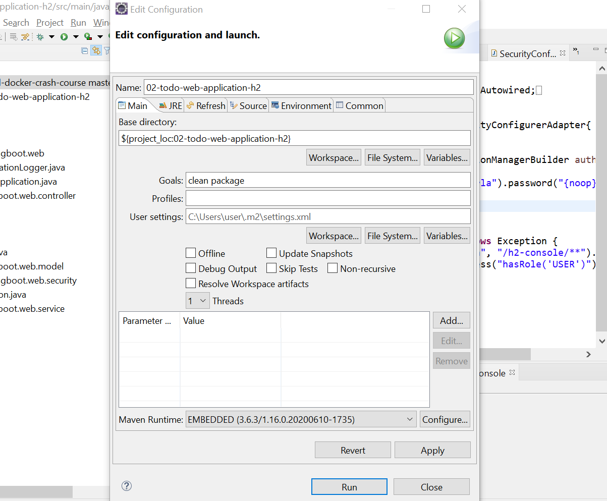
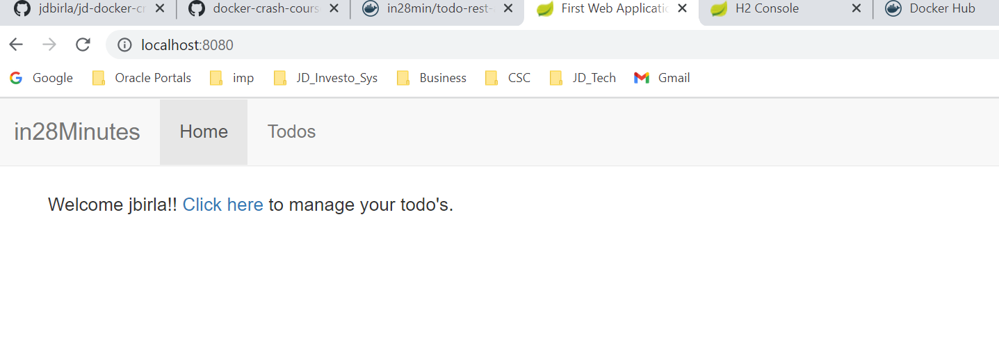

# JD Java Spring Boot Todo Web Application with Dockerld

## What You Will Learn during this Step 01:
- Setting up 02 Spring Boot Todo Web Application in Local 


Run com.in28minutes.springboot.web.SpringBootFirstWebApplication as a Java Application.

Runs on default port of Spring Boot - 8080 

## Can be run as a Jar or a WAR

`mvn clean install` generate a war which can deployed to your favorite web server.

We will deploy to Docker as a WAR

## Web Application

- http://localhost:8080/login with jbirla/dummy as credentials
- You can add, delete and update your todos
- Spring Security is used to secure the application
- `com.in28minutes.springboot.web.security.SecurityConfiguration` contains the in memory security credential configuration.

## H2 Console

- http://localhost:8080/h2-console
- Use `jdbc:h2:mem:testdb` as JDBC URL 




```
[INFO] Image will be built as jbirla/todo-web-application-h2:0.0.1-SNAPSHOT
[INFO] 
[INFO] Step 1/5 : FROM tomcat:8.0.51-jre8-alpine
[INFO] 
[INFO] Pulling from library/tomcat
[INFO] Digest: sha256:8c19caad3ac527eb88a8d75448d40216819da15ebf433fbc97b0d8513a9a0767
[INFO] Status: Image is up to date for tomcat:8.0.51-jre8-alpine
[INFO]  ---> fcc5ace83900
[INFO] Step 2/5 : EXPOSE 8080
[INFO] 
[INFO]  ---> Using cache
[INFO]  ---> adbba33a826f
[INFO] Step 3/5 : RUN rm -rf /usr/local/tomcat/webapps/*
[INFO] 
[INFO]  ---> Using cache
[INFO]  ---> c18453da204a
[INFO] Step 4/5 : COPY target/*.war /usr/local/tomcat/webapps/ROOT.war
[INFO] 
[INFO]  ---> a85aa7192ab1
[INFO] Step 5/5 : CMD ["catalina.sh","run"]
[INFO] 
[INFO]  ---> Running in 9f1673b48050
[INFO] Removing intermediate container 9f1673b48050
[INFO]  ---> 4eed235fbd0f
[INFO] Successfully built 4eed235fbd0f
[INFO] Successfully tagged jbirla/todo-web-application-h2:0.0.1-SNAPSHOT
[INFO] 
[INFO] Detected build of image with id 4eed235fbd0f
[INFO] Successfully built jbirla/todo-web-application-h2:0.0.1-SNAPSHOT
[INFO] ------------------------------------------------------------------------
[INFO] BUILD SUCCESS
[INFO] ------------------------------------------------------------------------
[INFO] Total time:  35.988 s
[INFO] Finished at: 2022-05-07T12:50:15+05:30
[INFO] ------------------------------------------------------------------------
```



---
## What You Will Learn during this Step 02:

- Create Docker Image for Spring Boot Todo Web Application

```docker
FROM tomcat:8.0.51-jre8-alpine
EXPOSE 8080
RUN rm -rf /usr/local/tomcat/webapps/*
COPY target/*.war /usr/local/tomcat/webapps/ROOT.war
CMD ["catalina.sh","run"]
```

### Dockerfile Maven

- https://github.com/spotify/dockerfile-maven

```
	<plugin>
		<groupId>com.spotify</groupId>
		<artifactId>dockerfile-maven-plugin</artifactId>
		<version>1.4.10</version>
		<executions>
			<execution>
				<id>default</id>
				<goals>
					<goal>build</goal>
				</goals>
			</execution>
		</executions>
		<configuration>
			<repository>jbirla/${project.name}</repository>
			<tag>${project.version}</tag>
			<skipDockerInfo>true</skipDockerInfo>
		</configuration>
	</plugin>
```

```docker

user@DESKTOP-AS2FQOH MINGW64 /c/D_Drive/DXC/Learning/Projects/jd-docker-crash-course/docker-crash-course-master/02-todo-web-application-h2 (master)
$ mvn clean package

user@DESKTOP-AS2FQOH MINGW64 /c/D_Drive/DXC/Learning/Projects/jd-docker-crash-course/docker-crash-course-master/02-todo-web-application-h2 (master)
$ docker container run -p 8080:8080 jbirla/todo-web-application-h2:0.0.1-SNAPSHOT

```

---
## What You Will Learn during this Step 03 and 04:

- Understanding ENTRYPOINT, CMD, COPY and ADD instructions
- Pushing 02 Spring Boot Todo Web Application to Docker Hub

### How to push a image to docker hub
```
user@DESKTOP-AS2FQOH MINGW64 /c/D_Drive/DXC/Learning/Projects/jd-docker-crash-course/docker-crash-course-master/02-todo-web-application-h2 (master)
$ docker images
REPOSITORY                       TAG                  IMAGE ID       CREATED             SIZE
jbirla/todo-web-application-h2   0.0.1-SNAPSHOT       fc41b76c2bd0   16 minutes ago      149MB
<none>                           <none>               4eed235fbd0f   29 minutes ago      149MB
jbirla/hello-world-rest-api      0.0.1-SNAPSHOT       efc0e6c37489   53 minutes ago      122MB
<none>                           <none>               04b0b95f0b09   About an hour ago   105MB
01-hello-world-rest-api          0.0.1-SNAPSHOT       73dba6f8fc53   2 days ago          147MB
jitubirla/hello-world-rest-api   dockerfile1          a9140d3fbe0b   2 days ago          122MB
<none>                           <none>               d0eb2f0f70c4   2 days ago          122MB
<none>                           <none>               058939030e6f   2 days ago          122MB
jitubirla/hello-world-rest-api   0.0.1-SNAPSHOT       abe382b1793d   2 days ago          122MB
<none>                           <none>               a02550b50868   2 days ago          122MB
<none>                           <none>               4aba1c6d85b1   2 days ago          122MB
<none>                           <none>               1ea7f95a9506   2 days ago          122MB
<none>                           <none>               56b977aa7529   2 days ago          122MB
<none>                           <none>               cc3fbea13df6   2 days ago          122MB
jitubirla/hello-world-rest-api   manual3              d75e467d5e50   2 days ago          122MB
hello-docker                     latest               5cf1242e3281   2 days ago          171MB
docker/getting-started           latest               cb90f98fd791   3 weeks ago         28.8MB
hello-world                      latest               feb5d9fea6a5   7 months ago        13.3kB
in28min/todo-rest-api-h2         1.0.0.RELEASE        f8049a029560   2 years ago         143MB
in28min/todo-rest-api-h2         latest               f8049a029560   2 years ago         143MB
openjdk                          8-jdk-alpine         a3562aa0b991   2 years ago         105MB
tomcat                           8.0.51-jre8-alpine   fcc5ace83900   4 years ago         106MB

user@DESKTOP-AS2FQOH MINGW64 /c/D_Drive/DXC/Learning/Projects/jd-docker-crash-course/docker-crash-course-master/02-todo-web-application-h2 (master)
$ docker push jbirla/todo-web-application-h2:0.0.1-SNAPSHOT
The push refers to repository [docker.io/jbirla/todo-web-application-h2]
f5747925cdc3: Preparing
af8842b31194: Preparing
7ea147abc4bf: Preparing
262192c9a09a: Preparing
f8f564cb1419: Preparing
638d4576a926: Preparing
c9b26f41504c: Preparing
cd7100a72410: Preparing
638d4576a926: Waiting
c9b26f41504c: Waiting
cd7100a72410: Waiting
7ea147abc4bf: Mounted from library/tomcat
262192c9a09a: Mounted from library/tomcat
f8f564cb1419: Mounted from library/tomcat
af8842b31194: Pushed
c9b26f41504c: Mounted from library/tomcat
638d4576a926: Mounted from library/tomcat
cd7100a72410: Mounted from library/tomcat
f5747925cdc3: Pushed
0.0.1-SNAPSHOT: digest: sha256:d38d3649572879ff9869a05bb90182a4dc3792c1fa49f67e3e8c21c2c53c892c size: 1993

user@DESKTOP-AS2FQOH MINGW64 /c/D_Drive/DXC/Learning/Projects/jd-docker-crash-course/docker-crash-course-master/02-todo-web-application-h2 (master)

```

### Docker hub [docker.io/jbirla/todo-web-application-h2]


---

