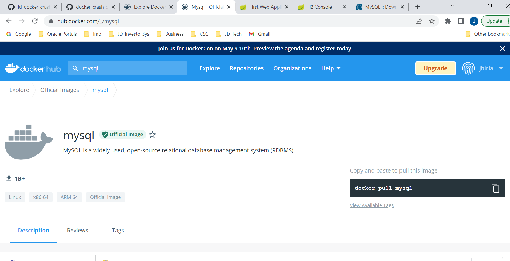
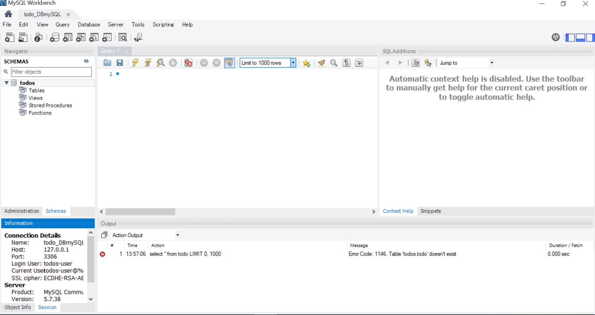
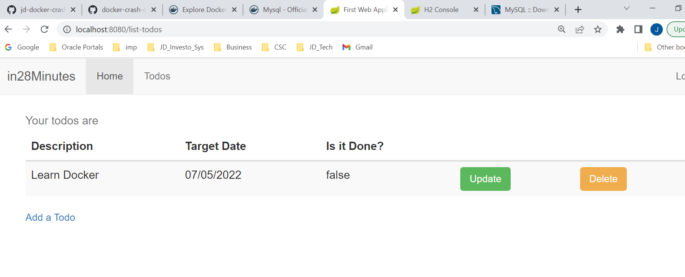
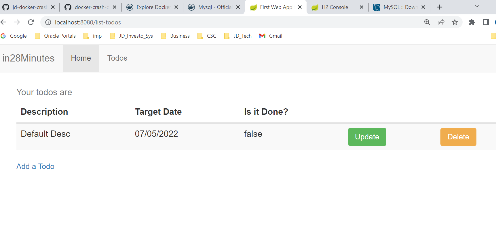
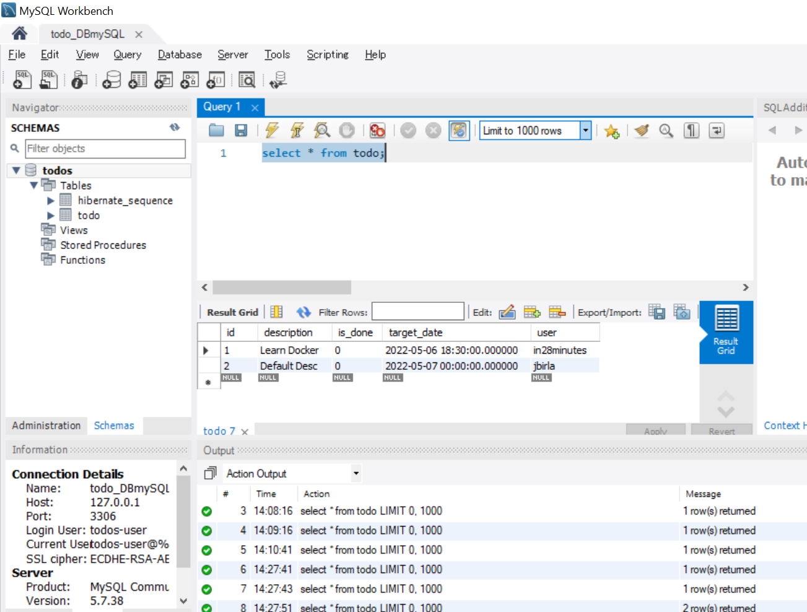

# JD Java Spring Boot Todo Web Application using MySQL with Docker

## What You Will Learn during this Step 01:
- Code Review of 03 Todo Web Application MySQL

---
## What You Will Learn during this Step 02:

- Running MySQL as Docker Container on Local

## Changes from H2 Application

#### pom.xml

```xml
<dependency>
	<groupId>com.h2database</groupId>
	<artifactId>h2</artifactId>
	<scope>test</scope>
</dependency>
<dependency>
	<groupId>mysql</groupId>
	<artifactId>mysql-connector-java</artifactId>
</dependency>
```

#### src/main/resources/application.properties

```properties
#spring.h2.console.enabled=true
#spring.h2.console.settings.web-allow-others=true

spring.jpa.hibernate.ddl-auto=update
spring.datasource.driver-class-name=com.mysql.cj.jdbc.Driver
spring.jpa.properties.hibernate.dialect=org.hibernate.dialect.MySQL55Dialect
spring.datasource.url=jdbc:mysql://localhost:3306/todos
spring.datasource.username=todos-user
spring.datasource.password=dummytodos
```

#### src/test/resources/application.properties

```properties
spring.jpa.hibernate.ddl-auto=create-drop
spring.datasource.driver-class-name=org.h2.Driver
spring.datasource.url=jdbc:h2:mem:testdb;DB_CLOSE_DELAY=-1
spring.datasource.username=sa
spring.datasource.password=sa
```

#### public class Todo

```java
@Size(min=10, message="Enter at least 10 Characters...")
@Column(name="description")
private String desc;
```


- Connect Spring Boot Todo Web App to MySQL on Local




```docker

user@DESKTOP-AS2FQOH MINGW64 /c/D_Drive/DXC/Learning/Projects/jd-docker-crash-course/docker-crash-course-master/02-todo-web-application-h2 (master)
$ docker run mysql:5.7
Unable to find image 'mysql:5.7' locally
5.7: Pulling from library/mysql
4be315f6562f: Pulling fs layer
96e2eb237a1b: Pulling fs layer
8aa3ac85066b: Pulling fs layer
ac7e524f6c89: Pulling fs layer
f6a88631064f: Pulling fs layer
15bb3ec3ff50: Pulling fs layer
ae65dc337dcb: Pulling fs layer
a4c4c43adf52: Pulling fs layer
c6cab33e8f91: Pulling fs layer
2e1c4f2c43f6: Pulling fs layer
2e5ee322af48: Pulling fs layer
ae65dc337dcb: Waiting
a4c4c43adf52: Waiting
c6cab33e8f91: Waiting
2e1c4f2c43f6: Waiting
2e5ee322af48: Waiting
ac7e524f6c89: Waiting
f6a88631064f: Waiting
15bb3ec3ff50: Waiting
96e2eb237a1b: Verifying Checksum
96e2eb237a1b: Download complete
ac7e524f6c89: Verifying Checksum
ac7e524f6c89: Download complete
f6a88631064f: Verifying Checksum
f6a88631064f: Download complete
8aa3ac85066b: Download complete
ae65dc337dcb: Verifying Checksum
ae65dc337dcb: Download complete
a4c4c43adf52: Verifying Checksum
a4c4c43adf52: Download complete
15bb3ec3ff50: Verifying Checksum
15bb3ec3ff50: Download complete
2e1c4f2c43f6: Verifying Checksum
2e1c4f2c43f6: Download complete
2e5ee322af48: Verifying Checksum
2e5ee322af48: Download complete
4be315f6562f: Verifying Checksum
4be315f6562f: Download complete
4be315f6562f: Pull complete
96e2eb237a1b: Pull complete
8aa3ac85066b: Pull complete
ac7e524f6c89: Pull complete
f6a88631064f: Pull complete
15bb3ec3ff50: Pull complete
ae65dc337dcb: Pull complete
a4c4c43adf52: Pull complete
c6cab33e8f91: Verifying Checksum
c6cab33e8f91: Download complete
c6cab33e8f91: Pull complete
2e1c4f2c43f6: Pull complete
2e5ee322af48: Pull complete
Digest: sha256:e767595ba3408fbb2dda493be3594b9a148178df58325fafe8b0363662935624
Status: Downloaded newer image for mysql:5.7
2022-05-07 08:11:11+00:00 [Note] [Entrypoint]: Entrypoint script for MySQL Server 5.7.38-1debian10 started.
2022-05-07 08:11:11+00:00 [Note] [Entrypoint]: Switching to dedicated user 'mysql'
2022-05-07 08:11:11+00:00 [Note] [Entrypoint]: Entrypoint script for MySQL Server 5.7.38-1debian10 started.
2022-05-07 08:11:11+00:00 [ERROR] [Entrypoint]: Database is uninitialized and password option is not specified
    You need to specify one of the following:
    - MYSQL_ROOT_PASSWORD
    - MYSQL_ALLOW_EMPTY_PASSWORD
    - MYSQL_RANDOM_ROOT_PASSWORD

user@DESKTOP-AS2FQOH MINGW64 /c/D_Drive/DXC/Learning/Projects/jd-docker-crash-course/docker-crash-course-master/02-todo-web-application-h2 (master)
$ docker run --detach --env MYSQL_ROOT_PASSWORD=dummypassword --env MYSQL_USER=todos-user --env MYSQL_PASSWORD=dummytodos --env MYSQL_DATABASE=todos --name mysql --publish 3306:3306 mysql:5.7
018b5938c5b4d4026ef234ea960a53a85746c2a1da00853b0e82710351cdb9a3

user@DESKTOP-AS2FQOH MINGW64 /c/D_Drive/DXC/Learning/Projects/jd-docker-crash-course/docker-crash-course-master/02-todo-web-application-h2 (master)
$ docker container ls
CONTAINER ID   IMAGE       COMMAND                  CREATED          STATUS          PORTS                               NAMES
018b5938c5b4   mysql:5.7   "docker-entrypoint.s…"   12 seconds ago   Up 11 seconds   0.0.0.0:3306->3306/tcp, 33060/tcp   mysql

user@DESKTOP-AS2FQOH MINGW64 /c/D_Drive/DXC/Learning/Projects/jd-docker-crash-course/docker-crash-course-master/02-todo-web-application-h2 (master)


```
### Launching MySQL using Docker

```
docker run --detach --env MYSQL_ROOT_PASSWORD=dummypassword --env MYSQL_USER=todos-user --env MYSQL_PASSWORD=dummytodos --env MYSQL_DATABASE=todos --name mysql --publish 3306:3306 mysql:5.7
```

Using Custom Network

```
docker run --detach --env MYSQL_ROOT_PASSWORD=dummypassword --env MYSQL_USER=todos-user --env MYSQL_PASSWORD=dummytodos --env MYSQL_DATABASE=todos --name mysql --publish 3306:3306 --network=web-application-mysql-network mysql:5.7
```

Using a Volume

```
docker run --detach --env MYSQL_ROOT_PASSWORD=dummypassword --env MYSQL_USER=todos-user --env MYSQL_PASSWORD=dummytodos --env MYSQL_DATABASE=todos --name mysql --publish 3306:3306 --network=web-application-mysql-network --volume mysql-database-volume:/var/lib/mysql  mysql:5.7
```

```sql
Name:  todo_DBmySQL 
Host: 127.0.0.1 
Port: 3306 
Login User: todos-user
Password: todos
```

### Install MySQL workbench and connect using above DB details




### Create Todo Table for Production

```sql
create table hibernate_sequence (next_val bigint) engine=InnoDB
insert into hibernate_sequence values ( 1 )
create table todo (id integer not null, description varchar(255), is_done bit not null, target_date datetime(6), user varchar(255), primary key (id)) engine=InnoDB
```




---
# What You Will Learn during this Step 04:
- Create Docker Image for 03 Todo Web Application and Use Link to connect

### step 1:  run the MySQL DB 
```
docker run --detach --env MYSQL_ROOT_PASSWORD=dummypassword --env MYSQL_USER=todos-user --env MYSQL_PASSWORD=dummytodos --env MYSQL_DATABASE=todos --name mysql --publish 3306:3306 mysql:5.7
PS C:\Users\user> docker container ls
CONTAINER ID   IMAGE       COMMAND                  CREATED          STATUS          PORTS                               NAMES
2190f89e2f83   mysql:5.7   "docker-entrypoint.s…"   18 minutes ago   Up 18 minutes   0.0.0.0:3306->3306/tcp, 33060/tcp   mysql
PS C:\Users\user>
```

### step 2:  Create docker image for the application
```
mvn clean package
```

### step 2: Launching Web App using Docker [Using Link]

```
docker container run -p 8080:8080 --link=mysql -e RDS_HOSTNAME=mysql  in28min/todo-web-application-mysql:0.0.1-SNAPSHOT
```





---
# What You Will Learn during this Step 05:

- Exploring Docker Networking - HOST, BRIDGE and NONE

```

user@DESKTOP-AS2FQOH MINGW64 /c/D_Drive/DXC/Learning/Projects/jd-docker-crash-course/docker-crash-course-master/03-todo-web-application-mysql (master)
$ docker network ls
NETWORK ID     NAME      DRIVER    SCOPE
c70ef2f3584d   bridge    bridge    local
255083134bd3   host      host      local
6c3790cf7d78   none      null      local

user@DESKTOP-AS2FQOH MINGW64 /c/D_Drive/DXC/Learning/Projects/jd-docker-crash-course/docker-crash-course-master/03-todo-web-application-mysql (master)
$ docker inspect bridge
[
    {
        "Name": "bridge",
        "Id": "c70ef2f3584dc0307425fdd49596b47a576d308cf2ecf2f190ed82db24406b67",
        "Created": "2022-05-04T05:51:39.1646438Z",
        "Scope": "local",
        "Driver": "bridge",
        "EnableIPv6": false,
        "IPAM": {
            "Driver": "default",
            "Options": null,
            "Config": [
                {
                    "Subnet": "172.17.0.0/16",
                    "Gateway": "172.17.0.1"
                }
            ]
        },
        "Internal": false,
        "Attachable": false,
        "Ingress": false,
        "ConfigFrom": {
            "Network": ""
        },
        "ConfigOnly": false,
        "Containers": {
            "2190f89e2f83ca3730eb7cae3d011bf6813b4e1f8d0f0b24c1ce2acfd1e230ff": {
                "Name": "mysql",
                "EndpointID": "fea605f6b746ef4da94f5352e5d66e3c57ac3f3200c6c56780833af62cdd7380",
                "MacAddress": "02:42:ac:11:00:02",
                "IPv4Address": "172.17.0.2/16",
                "IPv6Address": ""
            }
        },
        "Options": {
            "com.docker.network.bridge.default_bridge": "true",
            "com.docker.network.bridge.enable_icc": "true",
            "com.docker.network.bridge.enable_ip_masquerade": "true",
            "com.docker.network.bridge.host_binding_ipv4": "0.0.0.0",
            "com.docker.network.bridge.name": "docker0",
            "com.docker.network.driver.mtu": "1500"
        },
        "Labels": {}
    }
]

```
### In unix we can use host network as docker is directly intalled in unix os but in case of windows and mas desktop it won't work becasue in these docker runs in virtaul machine
- https://docs.docker.com/network/host/

* The host networking driver only works on Linux hosts, and is not supported on Docker Desktop for Mac, Docker Desktop for Windows, or Docker EE for Windows Server.
```
docker container run --network=host jbirla/todo-web-application-mysql:0.0.1-SNAPSHOT
```

---
# What You Will Learn during this Step 06:

- Creating a Custom Network and Connect MySQL and WebApplication to the network

```
PS C:\Users\user> docker network ls
NETWORK ID     NAME      DRIVER    SCOPE
c70ef2f3584d   bridge    bridge    local
255083134bd3   host      host      local
6c3790cf7d78   none      null      local
PS C:\Users\user> docker network create web-application-mysql-network
cbff1ab6f0711c9bcb3a11eb6e4c462e36f90ea274048c21c6b6c7ca179398f4
PS C:\Users\user> docker network ls
NETWORK ID     NAME                            DRIVER    SCOPE
c70ef2f3584d   bridge                          bridge    local
255083134bd3   host                            host      local
6c3790cf7d78   none                            null      local
cbff1ab6f071   web-application-mysql-network   bridge    local
PS C:\Users\user> docker container ls
CONTAINER ID   IMAGE       COMMAND                  CREATED          STATUS          PORTS                               NAMES
2190f89e2f83   mysql:5.7   "docker-entrypoint.s…"   49 minutes ago   Up 49 minutes   0.0.0.0:3306->3306/tcp, 33060/tcp   mysql
PS C:\Users\user> docker container stop 2190f89e2f83
2190f89e2f83
PS C:\Users\user> docker container ls
CONTAINER ID   IMAGE     COMMAND   CREATED   STATUS    PORTS     NAMES
PS C:\Users\user>
```

```
user@DESKTOP-AS2FQOH MINGW64 /c/D_Drive/DXC/Learning/Projects/jd-docker-crash-course/docker-crash-course-master/03-todo-web-application-mysql (master)
$ docker run --detach --env MYSQL_ROOT_PASSWORD=dummypassword --env MYSQL_USER=todos-user --env MYSQL_PASSWORD=dummytodos --env MYSQL_DATABASE=todos --name mysql --publish 3306:3306 --network=web-application-mysql-network mysql:5.7
docker: Error response from daemon: Conflict. The container name "/mysql" is already in use by container "2190f89e2f83ca3730eb7cae3d011bf6813b4e1f8d0f0b24c1ce2acfd1e230ff". You have to remove (or rename) that container to be able to reuse that name.
See 'docker run --help'.

user@DESKTOP-AS2FQOH MINGW64 /c/D_Drive/DXC/Learning/Projects/jd-docker-crash-course/docker-crash-course-master/03-todo-web-application-mysql (master)
$ docker rm mysql
mysql

user@DESKTOP-AS2FQOH MINGW64 /c/D_Drive/DXC/Learning/Projects/jd-docker-crash-course/docker-crash-course-master/03-todo-web-application-mysql (master)
$ docker run --detach --env MYSQL_ROOT_PASSWORD=dummypassword --env MYSQL_USER=todos-user --env MYSQL_PASSWORD=dummytodos --env MYSQL_DATABASE=todos --name mysql --publish 3306:3306 --network=web-application-mysql-network mysql:5.7
57ec702ebc76cfdf6a1471bcdb93d8ad1c9c9afb75115e1da846502b9d5f7a0b

user@DESKTOP-AS2FQOH MINGW64 /c/D_Drive/DXC/Learning/Projects/jd-docker-crash-course/docker-crash-course-master/03-todo-web-application-mysql (master)
$ docker container run -p 8080:8080 --network=web-application-mysql-network -e RDS_HOSTNAME=mysql  jbirla/todo-web-application-mysql:0.0.1-SNAPSHOT


```

```
PS C:\Users\user> docker network ls
NETWORK ID     NAME                            DRIVER    SCOPE
c70ef2f3584d   bridge                          bridge    local
255083134bd3   host                            host      local
6c3790cf7d78   none                            null      local
cbff1ab6f071   web-application-mysql-network   bridge    local
PS C:\Users\user> docker inspect cbff1ab6f071
[
    {
        "Name": "web-application-mysql-network",
        "Id": "cbff1ab6f0711c9bcb3a11eb6e4c462e36f90ea274048c21c6b6c7ca179398f4",
        "Created": "2022-05-07T09:13:55.9815078Z",
        "Scope": "local",
        "Driver": "bridge",
        "EnableIPv6": false,
        "IPAM": {
            "Driver": "default",
            "Options": {},
            "Config": [
                {
                    "Subnet": "172.18.0.0/16",
                    "Gateway": "172.18.0.1"
                }
            ]
        },
        "Internal": false,
        "Attachable": false,
        "Ingress": false,
        "ConfigFrom": {
            "Network": ""
        },
        "ConfigOnly": false,
        "Containers": {
            "57ec702ebc76cfdf6a1471bcdb93d8ad1c9c9afb75115e1da846502b9d5f7a0b": {
                "Name": "mysql",
                "EndpointID": "ea160fd9b703557a5f2dd0106eadf3db528cf860f3261fdfa9335b26052d3f64",
                "MacAddress": "02:42:ac:12:00:02",
                "IPv4Address": "172.18.0.2/16",
                "IPv6Address": ""
            },
            "a9e80bf436e71343c78a9f60ce8092c6d55949500bc59a2903652f8dfcb85c1c": {
                "Name": "festive_raman",
                "EndpointID": "c7d35b91fa4367217b88c1bb3ed85934da91bee8a0c5e6ecc6200605e638f980",
                "MacAddress": "02:42:ac:12:00:03",
                "IPv4Address": "172.18.0.3/16",
                "IPv6Address": ""
            }
        },
        "Options": {},
        "Labels": {}
    }
]
PS C:\Users\user>
PS C:\Users\user>
```

---
# What You Will Learn during this Step 07:
- Using Docker Volumes to Persist Data

### IF we stop mysql container and start again our data will be lost for the solution of this problem we can use volume


```
docker run --detach --env MYSQL_ROOT_PASSWORD=dummypassword --env MYSQL_USER=todos-user --env MYSQL_PASSWORD=dummytodos --env MYSQL_DATABASE=todos --name mysql --publish 3306:3306 --network=web-application-mysql-network --volume mysql-database-volume:/var/lib/mysql  mysql:5.7
```

