# JD Docker Crash Course

## What You Will Learn during this Step 00:
- Docker overview

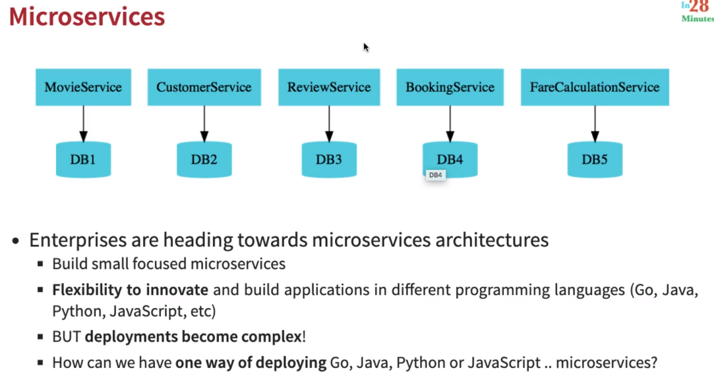

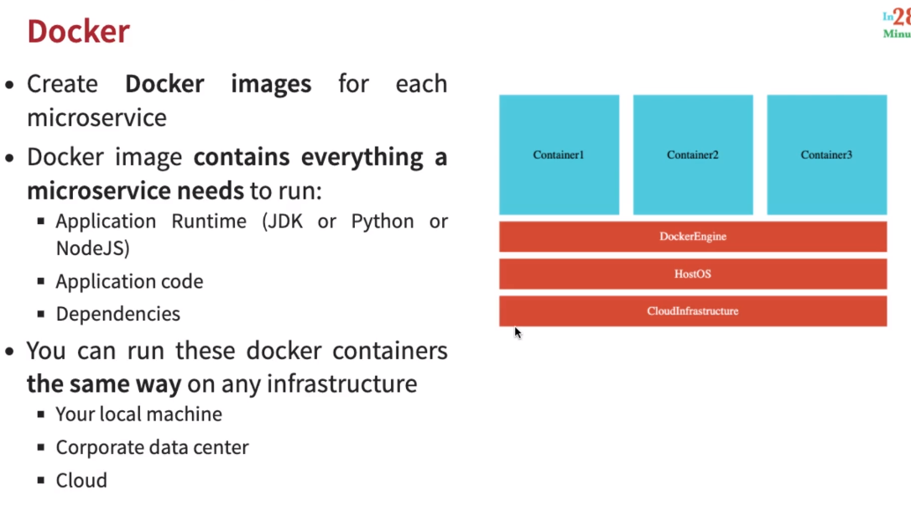

---

## How to install docker into Windows

1. Download docker from https://docs.docker.com/desktop/windows/install/
2. Follow the steps for install
3. Check virtualizatoin must be enabled

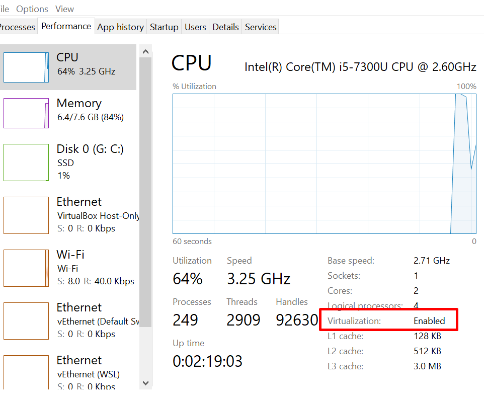

4. Go to Windows Features  --> enabled Hper-v and windows sub sytems for Linux

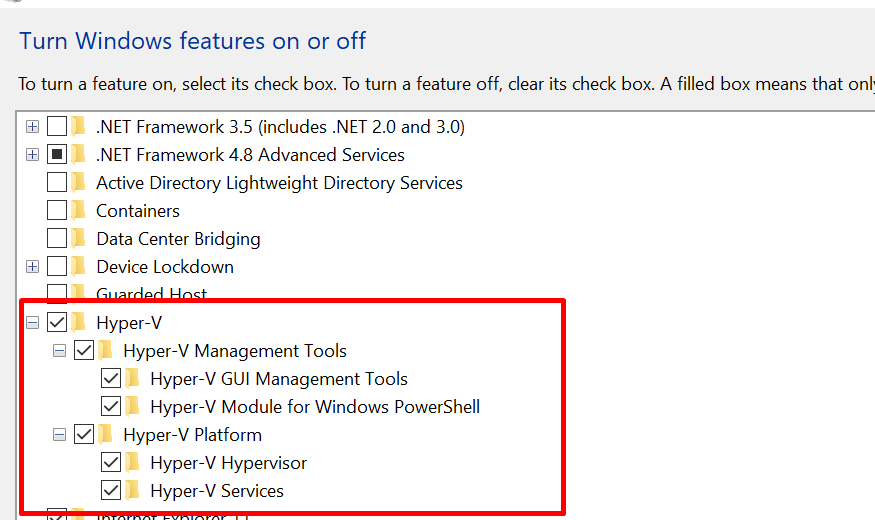

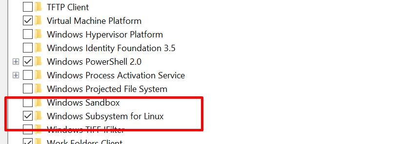

5. Excute below commands
  
   ```sh
   1. Open PowerShell/CMD as administrator 
   2. Run the command: bcdedit /set hypervisorlaunchtype auto
   3. dism.exe /Online /Enable-Feature:Microsoft-Hyper-V /All
   4. Restart your computer
   ```

6. Docker is running


```sh
Windows PowerShell
Copyright (C) Microsoft Corporation. All rights reserved.

Try the new cross-platform PowerShell https://aka.ms/pscore6

PS C:\WINDOWS\system32> docker --version
Docker version 20.10.14, build a224086
PS C:\WINDOWS\system32>
```

```sh
RECOMMENDATION : Use PowerShell in Windows!
Recommendation 1

If you are using Windows, make sure that you use PowerShell instead of Command Prompt.


Recommendation 2

If you are using Window 10 and are using docker toolbox

=> Use 192.168.99.100 instead of localhost.

Note: If 192.168.99.100 does not work, you can find the IP by using the command docker-machine ip


Reason

In Window 10 when using docker toolbox, docker is configured to use the default machine with IP 192.168.99.100


```

---
## What You Will Learn during this Step 02 and 03:


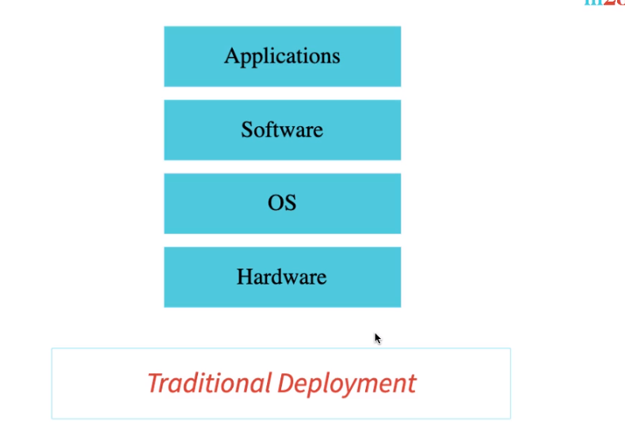

```sh
Windows PowerShell
Copyright (C) Microsoft Corporation. All rights reserved.

Try the new cross-platform PowerShell https://aka.ms/pscore6

PS C:\WINDOWS\system32> docker run -p 5000:5000 in28min/todo-rest-api-h2:1.0.0.RELEASE
```

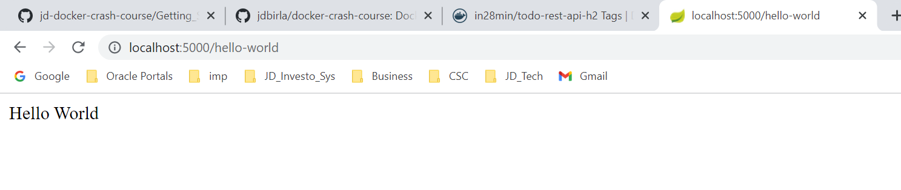

---
## What You Will Learn during this Step 04 :

```
docker run -p 5000:5000 -d in28min/todo-rest-api-h2:1.0.0.RELEASE
docker logs 0b6cacbaeac6f0b01549d55dd51154824cac0dcf3782dbd3fdb38e9d1964f38b
docker logs -f 0b6cacbaeac6f0b01549d55dd51154824cac0dcf3782dbd3fdb38e9d1964f38b
docker container ls
docker run -p 5001:5000 -d in28min/todo-rest-api-h2:1.0.0.RELEASE
docker images
docker container ls -a
C:\Users\user>docker container ls -a

CONTAINER ID   IMAGE                                    COMMAND                  CREATED          STATUS                        PORTS                    NAMES
2be719460eb4   in28min/todo-rest-api-h2:1.0.0.RELEASE   "sh -c 'java $JAVA_O…"   2 minutes ago    Up 2 minutes                  0.0.0.0:5001->5000/tcp   nifty_curran
0b6cacbaeac6   in28min/todo-rest-api-h2:1.0.0.RELEASE   "sh -c 'java $JAVA_O…"   8 minutes ago    Up 8 minutes                  0.0.0.0:5000->5000/tcp   infallible_robinson
e79687de64c2   in28min/todo-rest-api-h2:1.0.0.RELEASE   "sh -c 'java $JAVA_O…"   12 minutes ago   Exited (143) 8 minutes ago                             determined_chaplygin
721919b9bd47   in28min/todo-rest-api-h2:1.0.0.RELEASE   "sh -c 'java $JAVA_O…"   53 minutes ago   Exited (143) 12 minutes ago                            epic_wright
aa71222c3d71   docker/getting-started                   "/docker-entrypoint.…"   2 hours ago      Up 2 hours                    0.0.0.0:80->80/tcp       practical_shirley

docker container stop 2be71
docker container stop 0b6ca
```
---
## What You Will Learn during this Step 05 :


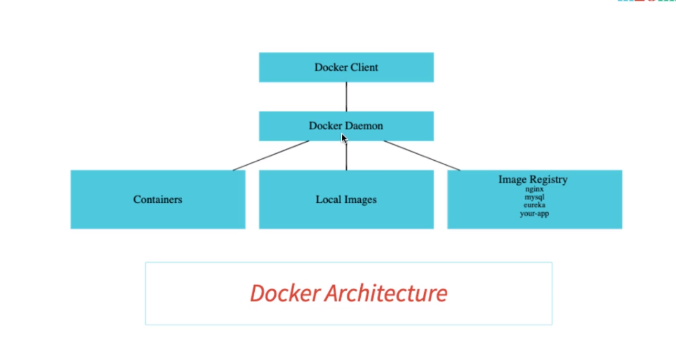

---
## What You Will Learn during this Step 06 :


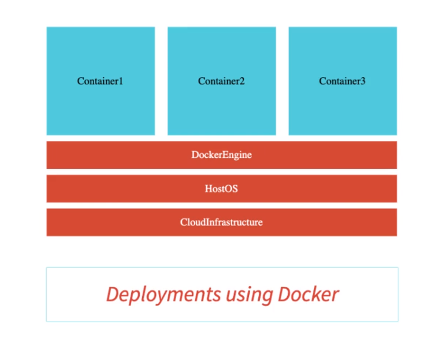

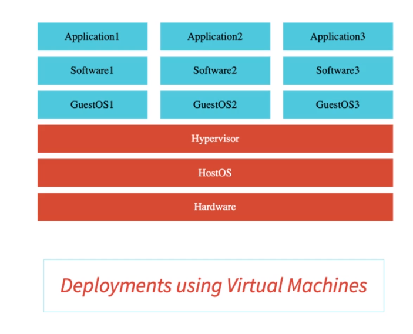

---
## What You Will Learn during this Step 07:

```docker
C:\Users\user>docker images

REPOSITORY                 TAG             IMAGE ID       CREATED       SIZE
docker/getting-started     latest          cb90f98fd791   3 weeks ago   28.8MB
in28min/todo-rest-api-h2   1.0.0.RELEASE   f8049a029560   2 years ago   143MB

C:\Users\user>docker tag in28min/todo-rest-api-h2:1.0.0.RELEASE in28min/todo-rest-api-h2:latest

C:\Users\user>docker images
REPOSITORY                 TAG             IMAGE ID       CREATED       SIZE
docker/getting-started     latest          cb90f98fd791   3 weeks ago   28.8MB
in28min/todo-rest-api-h2   1.0.0.RELEASE   f8049a029560   2 years ago   143MB
in28min/todo-rest-api-h2   latest          f8049a029560   2 years ago   143MB

C:\Users\user>docker pull mysql
Using default tag: latest
latest: Pulling from library/mysql
4be315f6562f: Pull complete
96e2eb237a1b: Pull complete
8aa3ac85066b: Pull complete
ac7e524f6c89: Pull complete
f6a88631064f: Pull complete
15bb3ec3ff50: Pull complete
ae65dc337dcb: Pull complete
573c3c7fa18d: Pull complete
9d10771b98b8: Pull complete
3d8ef442614b: Pull complete
7dc17a6cea26: Pull complete
752752efdaea: Pull complete
Digest: sha256:2dafe3f044f140ec6c07716d34f0b317b98f8e251435abd347951699f7aa3904
Status: Downloaded newer image for mysql:latest
docker.io/library/mysql:latest

C:\Users\user>docker images
REPOSITORY                 TAG             IMAGE ID       CREATED       SIZE
mysql                      latest          96d0eae5ed60   6 days ago    524MB
docker/getting-started     latest          cb90f98fd791   3 weeks ago   28.8MB
in28min/todo-rest-api-h2   1.0.0.RELEASE   f8049a029560   2 years ago   143MB
in28min/todo-rest-api-h2   latest          f8049a029560   2 years ago   143MB

C:\Users\user>docker search mysql
NAME                             DESCRIPTION                                     STARS     OFFICIAL   AUTOMATED
mysql                            MySQL is a widely used, open-source relation…   12510     [OK]
mariadb                          MariaDB Server is a high performing open sou…   4813      [OK]
mysql/mysql-server               Optimized MySQL Server Docker images. Create…   925                  [OK]
percona                          Percona Server is a fork of the MySQL relati…   575       [OK]
phpmyadmin                       phpMyAdmin - A web interface for MySQL and M…   522       [OK]
centos/mysql-57-centos7          MySQL 5.7 SQL database server                   93
mysql/mysql-cluster              Experimental MySQL Cluster Docker images. Cr…   93
bitnami/mysql                    Bitnami MySQL Docker Image                      70                   [OK]
ubuntu/mysql                     MySQL open source fast, stable, multi-thread…   31
circleci/mysql                   MySQL is a widely used, open-source relation…   25
mysql/mysql-router               MySQL Router provides transparent routing be…   24
google/mysql                     MySQL server for Google Compute Engine          21                   [OK]
vmware/harbor-db                 Mysql container for Harbor                      10
mysqlboy/docker-mydumper         docker-mydumper containerizes MySQL logical …   3
mysqlboy/mydumper                mydumper for mysql logcial backups              3
bitnami/mysqld-exporter                                                          3
ibmcom/mysql-s390x               Docker image for mysql-s390x                    2
newrelic/mysql-plugin            New Relic Plugin for monitoring MySQL databa…   1                    [OK]
mirantis/mysql                                                                   0
mysql/mysql-operator             MySQL Operator for Kubernetes                   0
ibmcom/tidb-ppc64le              TiDB is a distributed NewSQL database compat…   0
newrelic/k8s-nri-mysql           New Relic Infrastructure MySQL Integration (…   0
mysqlboy/elasticsearch                                                           0
cimg/mysql                                                                       0
mysqleatmydata/mysql-eatmydata                                                   0

C:\Users\user>docker image history 96d0eae5ed60
IMAGE          CREATED       CREATED BY                                      SIZE      COMMENT
96d0eae5ed60   6 days ago    /bin/sh -c #(nop)  CMD ["mysqld"]               0B
<missing>      6 days ago    /bin/sh -c #(nop)  EXPOSE 3306 33060            0B
<missing>      6 days ago    /bin/sh -c #(nop)  ENTRYPOINT ["docker-entry…   0B
<missing>      6 days ago    /bin/sh -c ln -s usr/local/bin/docker-entryp…   34B
<missing>      6 days ago    /bin/sh -c #(nop) COPY file:e9a583a365264f0f…   13.5kB
<missing>      6 days ago    /bin/sh -c #(nop) COPY dir:2e040acc386ebd23b…   1.12kB
<missing>      6 days ago    /bin/sh -c #(nop)  VOLUME [/var/lib/mysql]      0B
<missing>      6 days ago    /bin/sh -c {   echo mysql-community-server m…   387MB
<missing>      6 days ago    /bin/sh -c echo 'deb [ signed-by=/etc/apt/ke…   97B
<missing>      6 days ago    /bin/sh -c #(nop)  ENV MYSQL_VERSION=8.0.29-…   0B
<missing>      13 days ago   /bin/sh -c #(nop)  ENV MYSQL_MAJOR=8.0          0B
<missing>      13 days ago   /bin/sh -c set -eux;  key='859BE8D7C586F5384…   2.29kB
<missing>      13 days ago   /bin/sh -c set -eux;  apt-get update;  apt-g…   53.6MB
<missing>      13 days ago   /bin/sh -c mkdir /docker-entrypoint-initdb.d    0B
<missing>      13 days ago   /bin/sh -c set -eux;  savedAptMark="$(apt-ma…   4.06MB
<missing>      13 days ago   /bin/sh -c #(nop)  ENV GOSU_VERSION=1.14        0B
<missing>      13 days ago   /bin/sh -c apt-get update && apt-get install…   9.34MB
<missing>      13 days ago   /bin/sh -c groupadd -r mysql && useradd -r -…   329kB
<missing>      2 weeks ago   /bin/sh -c #(nop)  CMD ["bash"]                 0B
<missing>      2 weeks ago   /bin/sh -c #(nop) ADD file:011a43ee23214c201…   69.3MB

C:\Users\user>docker image inspect f8049a029560
[
    {
        "Id": "sha256:f8049a029560296f2c8d98a9668672ed9db1fc85ec0054f9fd9956ae79bf8827",
        "RepoTags": [
            "in28min/todo-rest-api-h2:1.0.0.RELEASE",
            "in28min/todo-rest-api-h2:latest"
        ],
        "RepoDigests": [
            "in28min/todo-rest-api-h2@sha256:903c333e39cf8156628ad7b4305bb78bfa6925828e6a3d0b7bc8416d455dc8e0"
        ],
        "Parent": "",
        "Comment": "",
        "Created": "2019-07-05T05:48:14.830997949Z",
        "Container": "0e423c57bf4ac2f9d8c9debea6113ee79e916c15e2401171d1bf678060919e9b",
        "ContainerConfig": {
            "Hostname": "0e423c57bf4a",
            "Domainname": "",
            "User": "",
            "AttachStdin": false,
            "AttachStdout": false,
            "AttachStderr": false,
            "ExposedPorts": {
                "5000/tcp": {}
            },
            "Tty": false,
            "OpenStdin": false,
            "StdinOnce": false,
            "Env": [
                "PATH=/usr/local/sbin:/usr/local/bin:/usr/sbin:/usr/bin:/sbin:/bin:/usr/lib/jvm/java-1.8-openjdk/jre/bin:/usr/lib/jvm/java-1.8-openjdk/bin",
                "LANG=C.UTF-8",
                "JAVA_HOME=/usr/lib/jvm/java-1.8-openjdk",
                "JAVA_VERSION=8u212",
                "JAVA_ALPINE_VERSION=8.212.04-r0",
                "JAVA_OPTS="
            ],
            "Cmd": [
                "/bin/sh",
                "-c",
                "#(nop) ",
                "ENTRYPOINT [\"sh\" \"-c\" \"java $JAVA_OPTS -Djava.security.egd=file:/dev/./urandom -jar /app.jar\"]"
            ],
            "ArgsEscaped": true,
            "Image": "sha256:82616270b25bfc67e0804644d7c221f21582ffc7aeb9887ccdd40e4413252ced",
            "Volumes": {
                "/tmp": {}
            },
            "WorkingDir": "",
            "Entrypoint": [
                "sh",
                "-c",
                "java $JAVA_OPTS -Djava.security.egd=file:/dev/./urandom -jar /app.jar"
            ],
            "OnBuild": null,
            "Labels": {}
        },
        "DockerVersion": "18.09.1",
        "Author": "",
        "Config": {
            "Hostname": "",
            "Domainname": "",
            "User": "",
            "AttachStdin": false,
            "AttachStdout": false,
            "AttachStderr": false,
            "ExposedPorts": {
                "5000/tcp": {}
            },
            "Tty": false,
            "OpenStdin": false,
            "StdinOnce": false,
            "Env": [
                "PATH=/usr/local/sbin:/usr/local/bin:/usr/sbin:/usr/bin:/sbin:/bin:/usr/lib/jvm/java-1.8-openjdk/jre/bin:/usr/lib/jvm/java-1.8-openjdk/bin",
                "LANG=C.UTF-8",
                "JAVA_HOME=/usr/lib/jvm/java-1.8-openjdk",
                "JAVA_VERSION=8u212",
                "JAVA_ALPINE_VERSION=8.212.04-r0",
                "JAVA_OPTS="
            ],
            "Cmd": null,
            "ArgsEscaped": true,
            "Image": "sha256:82616270b25bfc67e0804644d7c221f21582ffc7aeb9887ccdd40e4413252ced",
            "Volumes": {
                "/tmp": {}
            },
            "WorkingDir": "",
            "Entrypoint": [
                "sh",
                "-c",
                "java $JAVA_OPTS -Djava.security.egd=file:/dev/./urandom -jar /app.jar"
            ],
            "OnBuild": null,
            "Labels": null
        },
        "Architecture": "amd64",
        "Os": "linux",
        "Size": 142956365,
        "VirtualSize": 142956365,
        "GraphDriver": {
            "Data": {
                "LowerDir": "/var/lib/docker/overlay2/53f73574ac731c09aba5bc73bfb6e655492b55c5361223a68265276b1eaebcaa/diff:/var/lib/docker/overlay2/46c81ff5097deabec0ec4ede0a63bbd1b1babb30ca2b7e7900317d09a07d9299/diff:/var/lib/docker/overlay2/68d2a152aee930211be57e1543ccfd84f727b51b9729dbdfd6d652165ba9538f/diff",
                "MergedDir": "/var/lib/docker/overlay2/8f7d5c666e9d0c65894090de491d30951174beabccf401883a76405ec6f90e71/merged",
                "UpperDir": "/var/lib/docker/overlay2/8f7d5c666e9d0c65894090de491d30951174beabccf401883a76405ec6f90e71/diff",
                "WorkDir": "/var/lib/docker/overlay2/8f7d5c666e9d0c65894090de491d30951174beabccf401883a76405ec6f90e71/work"
            },
            "Name": "overlay2"
        },
        "RootFS": {
            "Type": "layers",
            "Layers": [
                "sha256:f1b5933fe4b5f49bbe8258745cf396afe07e625bdab3168e364daf7c956b6b81",
                "sha256:9b9b7f3d56a01e3d9076874990c62e7a516cc4032f784f421574d06b18ef9aa4",
                "sha256:ceaf9e1ebef5f9eaa707a838848a3c13800fcf32d7757be10d4b08fb85f1bc8a",
                "sha256:7105f77ebf51826efa553db260582220c794080ad3d98bb281224f82390d27fe"
            ]
        },
        "Metadata": {
            "LastTagTime": "2022-05-04T07:58:38.924822Z"
        }
    }
]

C:\Users\user>docker image remove 96d0eae5ed60
Untagged: mysql:latest
Untagged: mysql@sha256:2dafe3f044f140ec6c07716d34f0b317b98f8e251435abd347951699f7aa3904
Deleted: sha256:96d0eae5ed6069320a16ec1029b7378e330c31473bb7ba3027578c7c582c0076
Deleted: sha256:8b3106bcf588d8eb5b468b421e9de2559d51bfb4314c084a4e8d26a88ac0f28b
Deleted: sha256:a3d5651d373109abedaedd2a84bbdcdfc2efd18fc5ddc977365abfb11613dba5
Deleted: sha256:9eb4060a534852a3f9958111349521c81660d385bafbe88cd41acc5843c088ad
Deleted: sha256:064eedb664a6ec1774dd7b8e1e2d0696136b2d17004544d78888aa3db273ea23
Deleted: sha256:56def78a8b700366329f8fd6e5199c2d459f370630f0a6c537e54fa279dd8cee
Deleted: sha256:625e297c59e84d9cb5ae0dcd69714dcc7f3c823c281cce1616374232057c8fa9
Deleted: sha256:52994d077831159b79c473125916eb6874cebf38493e3046abe80935e181d8af
Deleted: sha256:9550bb960b1438abbdc93a0a5518055f4a455bbd65491e53fa795960ddf518a5
Deleted: sha256:d3dee54c8b55b10f9fe4100dd1fa6e59f98dbfbf84b5757f518d874f57acd1ec
Deleted: sha256:49ff85d13492ccda474015e5e7101f35e8cee2f4b23d2385195d8a897b4be097
Deleted: sha256:7310671d54d99fba70b7191bca28f8e9a4b5438c4b012a2ceca11cae17d3177b
Deleted: sha256:0ad3ddf4a4ce0fc9d65021897541c99e5497a11ced2419016147267df61732d3

C:\Users\user>docker images
REPOSITORY                 TAG             IMAGE ID       CREATED       SIZE
docker/getting-started     latest          cb90f98fd791   3 weeks ago   28.8MB
in28min/todo-rest-api-h2   1.0.0.RELEASE   f8049a029560   2 years ago   143MB
in28min/todo-rest-api-h2   latest          f8049a029560   2 years ago   143MB

C:\Users\user>
```
---
## What You Will Learn during this Step 08:

```docker
C:\Users\user>docker container run -p 5000:5000 -d in28min/todo-rest-api-h2:1.0.0.RELEASE
6c129dc16a1c6ccdc8c65de831efee8da3c9723605698d8b51435905b75e80df

C:\Users\user>docker container pause 6c129
6c129

C:\Users\user>docker logs -f 6c129
C:\Users\user>docker container unpause 6c129
6c129

C:\Users\user>docker container inspect 6c129

C:\Users\user>docker container inspect 6c129
[
    {
        "Id": "6c129dc16a1c6ccdc8c65de831efee8da3c9723605698d8b51435905b75e80df",
        "Created": "2022-05-04T08:13:14.2551396Z",
        "Path": "sh",
        "Args": [
            "-c",
            "java $JAVA_OPTS -Djava.security.egd=file:/dev/./urandom -jar /app.jar"
        ],
        "State": {
            "Status": "running",
            "Running": true,
            "Paused": false,
            "Restarting": false,
            "OOMKilled": false,
            "Dead": false,
            "Pid": 2332,
            "ExitCode": 0,
            "Error": "",
            "StartedAt": "2022-05-04T08:13:15.048048Z",
            "FinishedAt": "0001-01-01T00:00:00Z"
        },
        "Image": "sha256:f8049a029560296f2c8d98a9668672ed9db1fc85ec0054f9fd9956ae79bf8827",
        "ResolvConfPath": "/var/lib/docker/containers/6c129dc16a1c6ccdc8c65de831efee8da3c9723605698d8b51435905b75e80df/resolv.conf",
        "HostnamePath": "/var/lib/docker/containers/6c129dc16a1c6ccdc8c65de831efee8da3c9723605698d8b51435905b75e80df/hostname",
        "HostsPath": "/var/lib/docker/containers/6c129dc16a1c6ccdc8c65de831efee8da3c9723605698d8b51435905b75e80df/hosts",
        "LogPath": "/var/lib/docker/containers/6c129dc16a1c6ccdc8c65de831efee8da3c9723605698d8b51435905b75e80df/6c129dc16a1c6ccdc8c65de831efee8da3c9723605698d8b51435905b75e80df-json.log",
        "Name": "/objective_lumiere",
        "RestartCount": 0,
        "Driver": "overlay2",
        "Platform": "linux",
        "MountLabel": "",
        "ProcessLabel": "",
        "AppArmorProfile": "",
        "ExecIDs": null,
        "HostConfig": {
            "Binds": null,
            "ContainerIDFile": "",
            "LogConfig": {
                "Type": "json-file",
                "Config": {}
            },
            "NetworkMode": "default",
            "PortBindings": {
                "5000/tcp": [
                    {
                        "HostIp": "",
                        "HostPort": "5000"
                    }
                ]
            },
            "RestartPolicy": {
                "Name": "no",
                "MaximumRetryCount": 0
            },
            "AutoRemove": false,
            "VolumeDriver": "",
            "VolumesFrom": null,
            "CapAdd": null,
            "CapDrop": null,
            "CgroupnsMode": "host",
            "Dns": [],
            "DnsOptions": [],
            "DnsSearch": [],
            "ExtraHosts": null,
            "GroupAdd": null,
            "IpcMode": "private",
            "Cgroup": "",
            "Links": null,
            "OomScoreAdj": 0,
            "PidMode": "",
            "Privileged": false,
            "PublishAllPorts": false,
            "ReadonlyRootfs": false,
            "SecurityOpt": null,
            "UTSMode": "",
            "UsernsMode": "",
            "ShmSize": 67108864,
            "Runtime": "runc",
            "ConsoleSize": [
                30,
                120
            ],
            "Isolation": "",
            "CpuShares": 0,
            "Memory": 0,
            "NanoCpus": 0,
            "CgroupParent": "",
            "BlkioWeight": 0,
            "BlkioWeightDevice": [],
            "BlkioDeviceReadBps": null,
            "BlkioDeviceWriteBps": null,
            "BlkioDeviceReadIOps": null,
            "BlkioDeviceWriteIOps": null,
            "CpuPeriod": 0,
            "CpuQuota": 0,
            "CpuRealtimePeriod": 0,
            "CpuRealtimeRuntime": 0,
            "CpusetCpus": "",
            "CpusetMems": "",
            "Devices": [],
            "DeviceCgroupRules": null,
            "DeviceRequests": null,
            "KernelMemory": 0,
            "KernelMemoryTCP": 0,
            "MemoryReservation": 0,
            "MemorySwap": 0,
            "MemorySwappiness": null,
            "OomKillDisable": false,
            "PidsLimit": null,
            "Ulimits": null,
            "CpuCount": 0,
            "CpuPercent": 0,
            "IOMaximumIOps": 0,
            "IOMaximumBandwidth": 0,
            "MaskedPaths": [
                "/proc/asound",
                "/proc/acpi",
                "/proc/kcore",
                "/proc/keys",
                "/proc/latency_stats",
                "/proc/timer_list",
                "/proc/timer_stats",
                "/proc/sched_debug",
                "/proc/scsi",
                "/sys/firmware"
            ],
            "ReadonlyPaths": [
                "/proc/bus",
                "/proc/fs",
                "/proc/irq",
                "/proc/sys",
                "/proc/sysrq-trigger"
            ]
        },
        "GraphDriver": {
            "Data": {
                "LowerDir": "/var/lib/docker/overlay2/3c3297654ddf75a1f2ca5771dd4b7f4a89d86aafebeda7dc3b6c0ec540b04a19-init/diff:/var/lib/docker/overlay2/8f7d5c666e9d0c65894090de491d30951174beabccf401883a76405ec6f90e71/diff:/var/lib/docker/overlay2/53f73574ac731c09aba5bc73bfb6e655492b55c5361223a68265276b1eaebcaa/diff:/var/lib/docker/overlay2/46c81ff5097deabec0ec4ede0a63bbd1b1babb30ca2b7e7900317d09a07d9299/diff:/var/lib/docker/overlay2/68d2a152aee930211be57e1543ccfd84f727b51b9729dbdfd6d652165ba9538f/diff",
                "MergedDir": "/var/lib/docker/overlay2/3c3297654ddf75a1f2ca5771dd4b7f4a89d86aafebeda7dc3b6c0ec540b04a19/merged",
                "UpperDir": "/var/lib/docker/overlay2/3c3297654ddf75a1f2ca5771dd4b7f4a89d86aafebeda7dc3b6c0ec540b04a19/diff",
                "WorkDir": "/var/lib/docker/overlay2/3c3297654ddf75a1f2ca5771dd4b7f4a89d86aafebeda7dc3b6c0ec540b04a19/work"
            },
            "Name": "overlay2"
        },
        "Mounts": [
            {
                "Type": "volume",
                "Name": "f82f2e16bfa7dc60111b8e3de206e961be6c664e306ca2620358f6bada48d3af",
                "Source": "/var/lib/docker/volumes/f82f2e16bfa7dc60111b8e3de206e961be6c664e306ca2620358f6bada48d3af/_data",
                "Destination": "/tmp",
                "Driver": "local",
                "Mode": "",
                "RW": true,
                "Propagation": ""
            }
        ],
        "Config": {
            "Hostname": "6c129dc16a1c",
            "Domainname": "",
            "User": "",
            "AttachStdin": false,
            "AttachStdout": false,
            "AttachStderr": false,
            "ExposedPorts": {
                "5000/tcp": {}
            },
            "Tty": false,
            "OpenStdin": false,
            "StdinOnce": false,
            "Env": [
                "PATH=/usr/local/sbin:/usr/local/bin:/usr/sbin:/usr/bin:/sbin:/bin:/usr/lib/jvm/java-1.8-openjdk/jre/bin:/usr/lib/jvm/java-1.8-openjdk/bin",
                "LANG=C.UTF-8",
                "JAVA_HOME=/usr/lib/jvm/java-1.8-openjdk",
                "JAVA_VERSION=8u212",
                "JAVA_ALPINE_VERSION=8.212.04-r0",
                "JAVA_OPTS="
            ],
            "Cmd": null,
            "Image": "in28min/todo-rest-api-h2:1.0.0.RELEASE",
            "Volumes": {
                "/tmp": {}
            },
            "WorkingDir": "",
            "Entrypoint": [
                "sh",
                "-c",
                "java $JAVA_OPTS -Djava.security.egd=file:/dev/./urandom -jar /app.jar"
            ],
            "OnBuild": null,
            "Labels": {}
        },
        "NetworkSettings": {
            "Bridge": "",
            "SandboxID": "80f3c7f124cd709ecce6481fc0aee80d8906a5a14d3a9f5bfd9d465180de9ec5",
            "HairpinMode": false,
            "LinkLocalIPv6Address": "",
            "LinkLocalIPv6PrefixLen": 0,
            "Ports": {
                "5000/tcp": [
                    {
                        "HostIp": "0.0.0.0",
                        "HostPort": "5000"
                    }
                ]
            },
            "SandboxKey": "/var/run/docker/netns/80f3c7f124cd",
            "SecondaryIPAddresses": null,
            "SecondaryIPv6Addresses": null,
            "EndpointID": "c6f5dd93053ce3bfff9c8c915c5f2095e9746093374f9703f276b9ef9128b9e2",
            "Gateway": "172.17.0.1",
            "GlobalIPv6Address": "",
            "GlobalIPv6PrefixLen": 0,
            "IPAddress": "172.17.0.3",
            "IPPrefixLen": 16,
            "IPv6Gateway": "",
            "MacAddress": "02:42:ac:11:00:03",
            "Networks": {
                "bridge": {
                    "IPAMConfig": null,
                    "Links": null,
                    "Aliases": null,
                    "NetworkID": "c70ef2f3584dc0307425fdd49596b47a576d308cf2ecf2f190ed82db24406b67",
                    "EndpointID": "c6f5dd93053ce3bfff9c8c915c5f2095e9746093374f9703f276b9ef9128b9e2",
                    "Gateway": "172.17.0.1",
                    "IPAddress": "172.17.0.3",
                    "IPPrefixLen": 16,
                    "IPv6Gateway": "",
                    "GlobalIPv6Address": "",
                    "GlobalIPv6PrefixLen": 0,
                    "MacAddress": "02:42:ac:11:00:03",
                    "DriverOpts": null
                }
            }
        }
    }
]

C:\Users\user>docker container ls -a
CONTAINER ID   IMAGE                                    COMMAND                  CREATED          STATUS                        PORTS                    NAMES
6c129dc16a1c   in28min/todo-rest-api-h2:1.0.0.RELEASE   "sh -c 'java $JAVA_O…"   6 minutes ago    Up 6 minutes                  0.0.0.0:5000->5000/tcp   objective_lumiere
2be719460eb4   in28min/todo-rest-api-h2:1.0.0.RELEASE   "sh -c 'java $JAVA_O…"   39 minutes ago   Exited (143) 36 minutes ago                            nifty_curran
0b6cacbaeac6   in28min/todo-rest-api-h2:1.0.0.RELEASE   "sh -c 'java $JAVA_O…"   45 minutes ago   Exited (143) 35 minutes ago                            infallible_robinson
e79687de64c2   in28min/todo-rest-api-h2:1.0.0.RELEASE   "sh -c 'java $JAVA_O…"   49 minutes ago   Exited (143) 46 minutes ago                            determined_chaplygin
721919b9bd47   in28min/todo-rest-api-h2:1.0.0.RELEASE   "sh -c 'java $JAVA_O…"   2 hours ago      Exited (143) 50 minutes ago                            epic_wright
aa71222c3d71   docker/getting-started                   "/docker-entrypoint.…"   2 hours ago      Up 2 hours                    0.0.0.0:80->80/tcp       practical_shirley

C:\Users\user>docker container prune
WARNING! This will remove all stopped containers.
Are you sure you want to continue? [y/N] y
Deleted Containers:
2be719460eb41550b975903c661cdcb2011aae59b4164c86a1cf1def32c94855
0b6cacbaeac6f0b01549d55dd51154824cac0dcf3782dbd3fdb38e9d1964f38b
e79687de64c27547c5d3ee44ffd5718d0ede27f069f70a81ed1ef3fe2e350a9e
721919b9bd47254aad500661efb6f613f29c5f00473be5560c36e24ecdba72e9

Total reclaimed space: 0B

C:\Users\user>docker container ls -a
CONTAINER ID   IMAGE                                    COMMAND                  CREATED         STATUS         PORTS                    NAMES
6c129dc16a1c   in28min/todo-rest-api-h2:1.0.0.RELEASE   "sh -c 'java $JAVA_O…"   7 minutes ago   Up 7 minutes   0.0.0.0:5000->5000/tcp   objective_lumiere
aa71222c3d71   docker/getting-started                   "/docker-entrypoint.…"   2 hours ago     Up 2 hours     0.0.0.0:80->80/tcp       practical_shirley

C:\Users\user>docker container stop 6c129
C:\Users\user>docker container kill 6c129

C:\Users\user> docker container run -p 5000:5000 -d --restart=always in28min/todo-rest-api-h2:1.0.0.RELEASE

```


* Output

* docker container pause 6c129

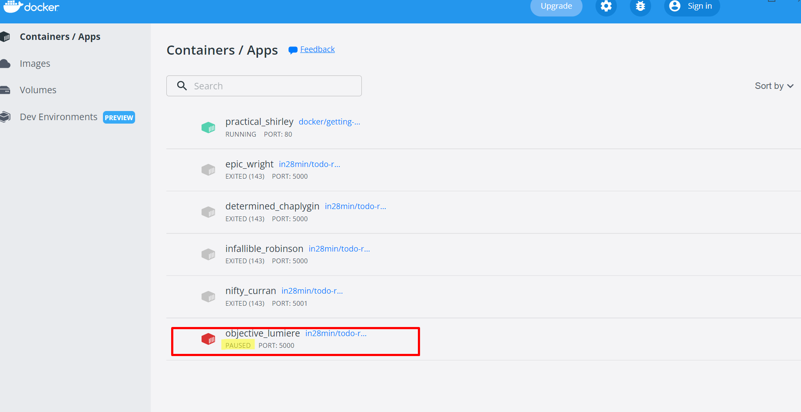

* docker container unpause 6c129

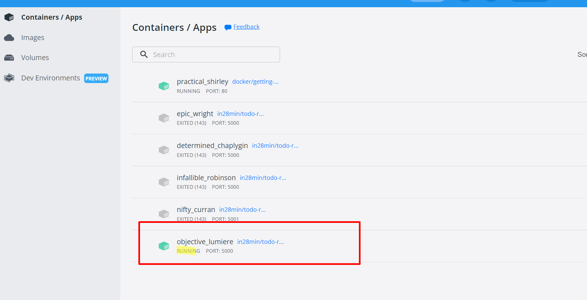

* docker container stop 6c129 && docker container kill 6c129

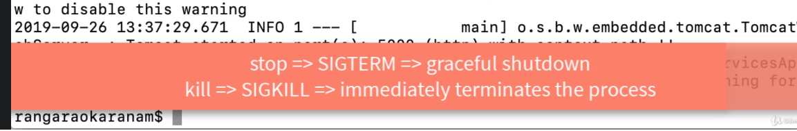

---
## What You Will Learn during this Step 09:

```docker
C:\Users\user>docker events
2022-05-04T14:04:17.234091600+05:30 volume create 1ce8ace8c651da3fb5d4c486cabbf19bc2c4c65350343c12c1ed1889e59568a9 (driver=local)
2022-05-04T14:04:17.248819700+05:30 container create b7de80246e825b5e868f9d322a34ec53a250a7644c04696649e70b855041641c (image=in28min/todo-rest-api-h2:1.0.0.RELEASE, name=gracious_curran)
2022-05-04T14:04:17.449181900+05:30 network connect c70ef2f3584dc0307425fdd49596b47a576d308cf2ecf2f190ed82db24406b67 (container=b7de80246e825b5e868f9d322a34ec53a250a7644c04696649e70b855041641c, name=bridge, type=bridge)
2022-05-04T14:04:17.454107300+05:30 volume mount 1ce8ace8c651da3fb5d4c486cabbf19bc2c4c65350343c12c1ed1889e59568a9 (container=b7de80246e825b5e868f9d322a34ec53a250a7644c04696649e70b855041641c, destination=/tmp, driver=local, propagation=, read/write=true)
2022-05-04T14:04:17.926071200+05:30 container start b7de80246e825b5e868f9d322a34ec53a250a7644c04696649e70b855041641c (image=in28min/todo-rest-api-h2:1.0.0.RELEASE, name=gracious_curran)

C:\Users\user>docker top
"docker top" requires at least 1 argument.
See 'docker top --help'.

Usage:  docker top CONTAINER [ps OPTIONS]

Display the running processes of a container

C:\Users\user>docker container ls
CONTAINER ID   IMAGE                                    COMMAND                  CREATED         STATUS         PORTS                    NAMES
b7de80246e82   in28min/todo-rest-api-h2:1.0.0.RELEASE   "sh -c 'java $JAVA_O…"   2 minutes ago   Up 2 minutes   0.0.0.0:5000->5000/tcp   gracious_curran
aa71222c3d71   docker/getting-started                   "/docker-entrypoint.…"   3 hours ago     Up 3 hours     0.0.0.0:80->80/tcp       practical_shirley

C:\Users\user>docker container top b7de
UID                 PID                 PPID                C                   STIME               TTY                 TIME                CMD
root                2484                2463                39                  08:34               ?                   00:00:57            java -Djava.security.egd=file:/dev/./urandom -jar /app.jar

C:\Users\user>docker stats
CONTAINER ID   NAME                CPU %     MEM USAGE / LIMIT     MEM %     NET I/O          BLOCK I/O   PIDS
b7de80246e82   gracious_curran     0.29%     463.8MiB / 5.892GiB   7.69%     866B / 0B        0B / 0B     33
aa71222c3d71   practical_shirley   0.00%     3.965MiB / 5.892GiB   0.07%     17.9kB / 586kB   0B / 0B     5
CONTAINER ID   NAME                CPU %     MEM USAGE / LIMIT     MEM %     NET I/O          BLOCK I/O   PIDS
b7de80246e82   gracious_curran     0.10%     463.8MiB / 5.892GiB   7.69%     866B / 0B        0B / 0B     33
aa71222c3d71   practical_shirley   0.00%     3.965MiB / 5.892GiB   0.07%     17.9kB / 586kB   0B / 0B     5
CONTAINER ID   NAME                CPU %     MEM USAGE / LIMIT     MEM %     NET I/O          BLOCK I/O   PIDS
b7de80246e82   gracious_curran     0.10%     463.8MiB / 5.892GiB   7.69%     866B / 0B        0B / 0B     33
aa71222c3d71   practical_shirley   0.00%     3.965MiB / 5.892GiB   0.07%     17.9kB / 586kB   0B / 0B     5
CONTAINER ID   NAME                CPU %     MEM USAGE / LIMIT     MEM %     NET I/O          BLOCK I/O   PIDS
b7de80246e82   gracious_curran     0.36%     463.8MiB / 5.892GiB   7.69%     866B / 0B        0B / 0B     33
aa71222c3d71   practical_shirley   0.00%     3.965MiB / 5.892GiB   0.07%     17.9kB / 586kB   0B / 0B     5
CONTAINER ID   NAME                CPU %     MEM USAGE / LIMIT     MEM %     NET I/O          BLOCK I/O   PIDS
b7de80246e82   gracious_curran     0.36%     463.8MiB / 5.892GiB   7.69%     866B / 0B        0B / 0B     33
aa71222c3d71   practical_shirley   0.00%     3.965MiB / 5.892GiB   0.07%     17.9kB / 586kB   0B / 0B     5
CONTAINER ID   NAME                CPU %     MEM USAGE / LIMIT     MEM %     NET I/O          BLOCK I/O   PIDS
b7de80246e82   gracious_curran     0.36%     463.8MiB / 5.892GiB   7.69%     866B / 0B        0B / 0B     33
aa71222c3d71   practical_shirley   0.00%     3.965MiB / 5.892GiB   0.07%     17.9kB / 586kB   0B / 0B     5
CONTAINER ID   NAME                CPU %     MEM USAGE / LIMIT     MEM %     NET I/O          BLOCK I/O   PIDS
b7de80246e82   gracious_curran     0.19%     463.8MiB / 5.892GiB   7.69%     866B / 0B        0B / 0B     33
aa71222c3d71   practical_shirley   0.00%     3.965MiB / 5.892GiB   0.07%     17.9kB / 586kB   0B / 0B     5
CONTAINER ID   NAME                CPU %     MEM USAGE / LIMIT     MEM %     NET I/O          BLOCK I/O   PIDS
b7de80246e82   gracious_curran     0.19%     463.8MiB / 5.892GiB   7.69%     866B / 0B        0B / 0B     33
aa71222c3d71   practical_shirley   0.00%     3.965MiB / 5.892GiB   0.07%     17.9kB / 586kB   0B / 0B     5
CONTAINER ID   NAME                CPU %     MEM USAGE / LIMIT     MEM %     NET I/O          BLOCK I/O   PIDS
b7de80246e82   gracious_curran     0.12%     463.8MiB / 5.892GiB   7.69%     866B / 0B        0B / 0B     33
aa71222c3d71   practical_shirley   0.00%     3.965MiB / 5.892GiB   0.07%     17.9kB / 586kB   0B / 0B     5
CONTAINER ID   NAME                CPU %     MEM USAGE / LIMIT     MEM %     NET I/O          BLOCK I/O   PIDS
b7de80246e82   gracious_curran     0.12%     463.8MiB / 5.892GiB   7.69%     866B / 0B        0B / 0B     33
aa71222c3d71   practical_shirley   0.00%     3.965MiB / 5.892GiB   0.07%     17.9kB / 586kB   0B / 0B     5
CONTAINER ID   NAME                CPU %     MEM USAGE / LIMIT     MEM %     NET I/O          BLOCK I/O   PIDS
b7de80246e82   gracious_curran     0.11%     463.8MiB / 5.892GiB   7.69%     866B / 0B        0B / 0B     33
aa71222c3d71   practical_shirley   0.00%     3.965MiB / 5.892GiB   0.07%     17.9kB / 586kB   0B / 0B     5
CONTAINER ID   NAME                CPU %     MEM USAGE / LIMIT     MEM %     NET I/O          BLOCK I/O   PIDS
b7de80246e82   gracious_curran     0.11%     463.8MiB / 5.892GiB   7.69%     866B / 0B        0B / 0B     33
aa71222c3d71   practical_shirley   0.00%     3.965MiB / 5.892GiB   0.07%     17.9kB / 586kB   0B / 0B     5
CONTAINER ID   NAME                CPU %     MEM USAGE / LIMIT     MEM %     NET I/O          BLOCK I/O   PIDS
b7de80246e82   gracious_curran     0.10%     463.8MiB / 5.892GiB   7.69%     866B / 0B        0B / 0B     33
aa71222c3d71   practical_shirley   0.00%     3.965MiB / 5.892GiB   0.07%     17.9kB / 586kB   0B / 0B     5
CONTAINER ID   NAME                CPU %     MEM USAGE / LIMIT     MEM %     NET I/O          BLOCK I/O   PIDS
b7de80246e82   gracious_curran     0.10%     463.8MiB / 5.892GiB   7.69%     866B / 0B        0B / 0B     33
aa71222c3d71   practical_shirley   0.00%     3.965MiB / 5.892GiB   0.07%     17.9kB / 586kB   0B / 0B     5


C:\Users\user>docker container run -p 5001:5000 -m 512m --cpu-quota 5000 -d --restart=always in28min/todo-rest-api-h2:1.0.0.RELEASE
f2f6dd7c1edb96fc140afbece074809b65b1ab0fa175fcf829920589a73428f7

C:\Users\user>docker system df
TYPE            TOTAL     ACTIVE    SIZE      RECLAIMABLE
Images          2         2         171.7MB   0B (0%)
Containers      3         2         1.095kB   0B (0%)
Local Volumes   8         2         32.77kB   0B (0%)
Build Cache     0         0         0B        0B

C:\Users\user>

```
---
