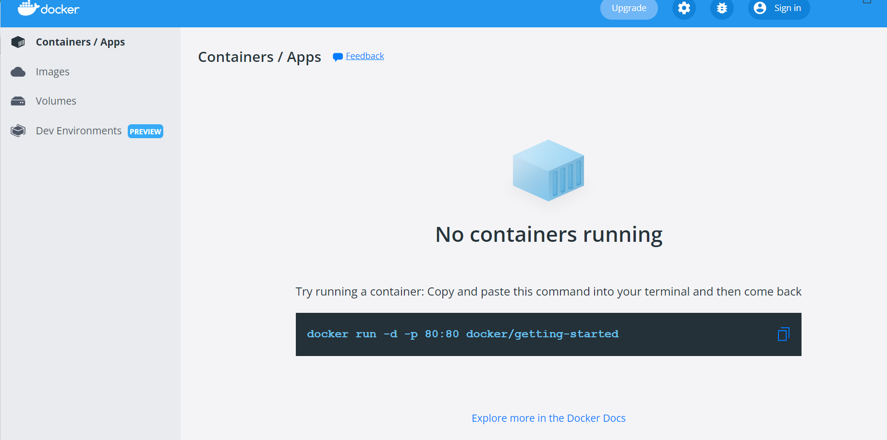

# JD Docker Crash Course

## What You Will Learn during this Step 00:
- Docker overview


---

## How to install docker into Windows

1. Download docker from https://docs.docker.com/desktop/windows/install/
2. Follow the steps for install
3. Check virtualizatoin must be enabled


4. Go to Windows Features  --> enabled Hper-v and windows sub sytems for Linux


5. Excute below commands
  
   ```sh
   1. Open PowerShell/CMD as administrator 
   2. Run the command: bcdedit /set hypervisorlaunchtype auto
   3. dism.exe /Online /Enable-Feature:Microsoft-Hyper-V /All
   4. Restart your computer
   ```

6. Docker is running



```sh
Windows PowerShell
Copyright (C) Microsoft Corporation. All rights reserved.

Try the new cross-platform PowerShell https://aka.ms/pscore6

PS C:\WINDOWS\system32> docker --version
Docker version 20.10.14, build a224086
PS C:\WINDOWS\system32>
```

```sh
RECOMMENDATION : Use PowerShell in Windows!
Recommendation 1

If you are using Windows, make sure that you use PowerShell instead of Command Prompt.


Recommendation 2

If you are using Window 10 and are using docker toolbox

=> Use 192.168.99.100 instead of localhost.

Note: If 192.168.99.100 does not work, you can find the IP by using the command docker-machine ip


Reason

In Window 10 when using docker toolbox, docker is configured to use the default machine with IP 192.168.99.100


```

---
## What You Will Learn during this Step 02 and 03:


```sh
Windows PowerShell
Copyright (C) Microsoft Corporation. All rights reserved.

Try the new cross-platform PowerShell https://aka.ms/pscore6

PS C:\WINDOWS\system32> docker run -p 5000:5000 in28min/todo-rest-api-h2:1.0.0.RELEASE
```


---
## What You Will Learn during this Step 04 :

```
docker run -p 5000:5000 -d in28min/todo-rest-api-h2:1.0.0.RELEASE
docker logs 0b6cacbaeac6f0b01549d55dd51154824cac0dcf3782dbd3fdb38e9d1964f38b
docker logs -f 0b6cacbaeac6f0b01549d55dd51154824cac0dcf3782dbd3fdb38e9d1964f38b
docker container ls
docker run -p 5001:5000 -d in28min/todo-rest-api-h2:1.0.0.RELEASE
docker images
docker container ls -a
C:\Users\user>docker container ls -a

CONTAINER ID   IMAGE                                    COMMAND                  CREATED          STATUS                        PORTS                    NAMES
2be719460eb4   in28min/todo-rest-api-h2:1.0.0.RELEASE   "sh -c 'java $JAVA_O…"   2 minutes ago    Up 2 minutes                  0.0.0.0:5001->5000/tcp   nifty_curran
0b6cacbaeac6   in28min/todo-rest-api-h2:1.0.0.RELEASE   "sh -c 'java $JAVA_O…"   8 minutes ago    Up 8 minutes                  0.0.0.0:5000->5000/tcp   infallible_robinson
e79687de64c2   in28min/todo-rest-api-h2:1.0.0.RELEASE   "sh -c 'java $JAVA_O…"   12 minutes ago   Exited (143) 8 minutes ago                             determined_chaplygin
721919b9bd47   in28min/todo-rest-api-h2:1.0.0.RELEASE   "sh -c 'java $JAVA_O…"   53 minutes ago   Exited (143) 12 minutes ago                            epic_wright
aa71222c3d71   docker/getting-started                   "/docker-entrypoint.…"   2 hours ago      Up 2 hours                    0.0.0.0:80->80/tcp       practical_shirley

docker container stop 2be71
docker container stop 0b6ca
```
---
## What You Will Learn during this Step 05 :


---


